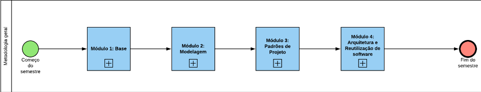
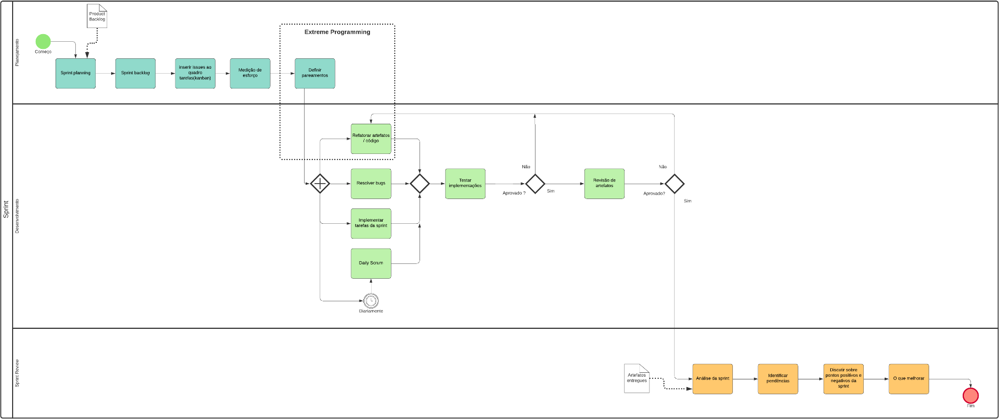
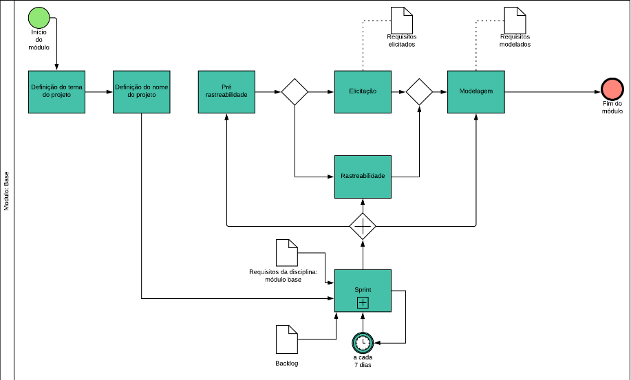
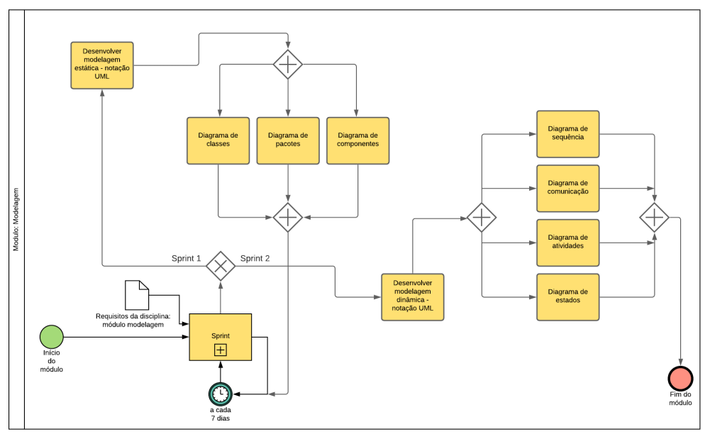

## Introdução

O diagrama BPMN tem o objetivo de criar um padrão, uma linguagem comum para modelagem de processos da metodologia da equipe, permitindo melhor ilustração e comunicação de todo processo

## Metodologia

O diagrama BPMN foi modelado de acordo com os [processos metodológicos](./metodologia.md) definidos pela equipe . A equipe utilizou o template de BPMN do lucidchart para elaboração do diagrama metodológico.

## Diagrama BPMN

### Versão 1.0

#### BPMN Geral da disciplina

#### BPMN Sprint

#### BPMN Módulo Base

#### BPMN Módulo Modelagem

## Conclusão

Os diagramas elaborados permitiram uma melhor ilustração e comunicação sobre os processos metodológicos abordados.

## Referências

> Notação BPMN 2.0. Disponivel em: https://www.heflo.com/pt-br/bpm/notacao-bpmn/

> Object Management Group, Business Process Model and Notation. Disponível em http://www.bpmn.org/. Acesso em 25/09/20.

## Autor(es)

| Data | Versão | Descrição | Autor(es) |
| -- | -- | -- | -- |
| 11/09/20 | 1.0 | Elaboração dos diagramas BPMN | João Pedro, Lucas Alexandre, Matheus Estanislau, Moacir Mascarenha e Renan Cristyan| 
| 11/09/20 | 1.1 | Criação do documento | João Pedro e Matheus Estanislau | 
| 25/09/20 | 1.2 | Adição do diagrama do módulo modelagem | Renan Cristyan | 