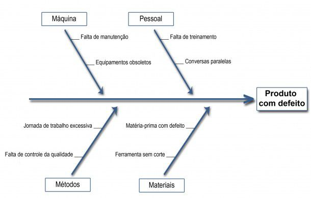
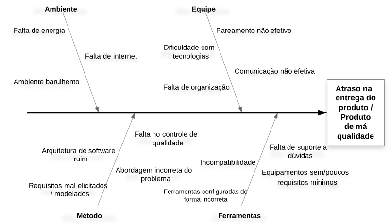
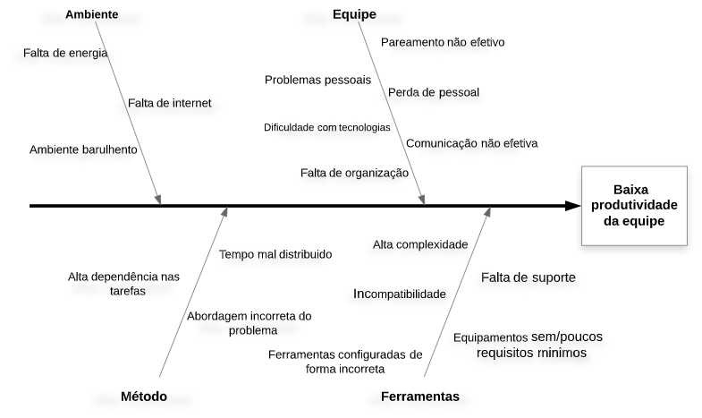

## Introdução
O diagrama de Causa e Efeito, também conhecido como Diagrama de Ishikawa ou Diagrama de Espinha de Peixe, é uma ferramenta visual que ajuda na análise de problemas. O Diagrama de Ishikawa consiste em focar em um problema (efeito) e posicioná-lo ao final de uma seta horizontal. Depois, deve-se criar ramos onde ficarão as categorias das causas do problema e, em cada ramo, citar exemplos de coisas que contribuam para o problema.

## Metodologia

 Com a identificação de problemas para o projeto e equipe é possivel elaborar os diagramas de causa e efeito, utilizando a ferramenta [lucidchart](www.lucidchart.com), baseados nos 6Ms de Ishikawa, sendo eles:

- Método
- Máquina
- Medida
- Meio ambiente
- Material
- Mão de obra 

	Ao final da construção do diagrama e de sua análise, deverá ser possível pensar em maneiras de se evitar o problema principal.
    #### Exemplo:
    

    Figura 1. [Exemplo de Diagrama de Ishikawa](https://blogdaqualidade.com.br/diagrama-de-ishikawa/)

## Diagramas

### Versão 1.0

### Atraso na entrega do produto / Produto de má qualidade

### Baixa produtividade da equipe

## Conclusão

    O uso do diagrama possibilita identificar problemas e suas principais causas, auxiliando na identificação e solução dos problemas mais simples aos mais complexos. Além disso o diagrama é uma ferramenta importante para a gestão da qualidade.

## Referências
> Diagrama de Ishikawa: O que é e como fazer? Disponível em:  https://www.siteware.com.br/metodologias/diagrama-de-ishikawa/ Acesso em 25/08/20.

> Diagrama de Ishikawa. Disponível em: https://blogdaqualidade.com.br/diagrama-de-ishikawa/ Acesso em 26/08/20.

## Autor(es)

| Data | Versão | Descrição | Autor(es) |
| -- | -- | -- | -- |
| 25/08/20 | 1.0 | Criação do documento | Moacir Mascarenha e Renan Cristyan |
| 26/08/20 | 1.1 | Adição da metodologia | Moacir Mascarenha e Renan Cristyan | 
