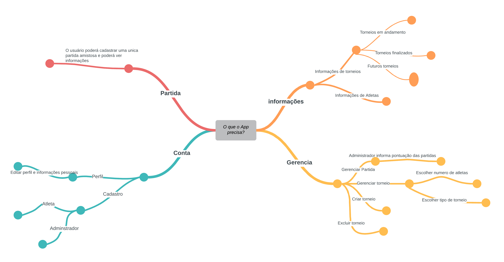
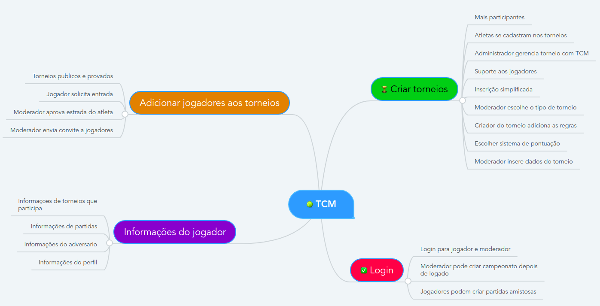

## Introdução

Mapa mental consiste em criar resumos cheios de símbolos, cores, setas e frases de efeito com o objetivo de organizar o conteúdo e facilitar associações entre as informações destacadas. Esse material é muito indicado para pessoas que têm facilidade de aprender de forma visual.

## Metodologia

 Foi levantado um ponto importante sobre o app e, assim, foi produzido o mapa mental. O documento foi produzido utilizando a ferramenta lucidchart.

## Mapa mental - Geral.

## Versão 1.0

### Mapa mental 1

### Mapa mental 2

## Conclusão

O mapa mental é uma ficha de estudos que ajuda a dar uma visão geral do tema, e ajuda a fixar os pontos mais importantes sobre o app.
 

## Referências
> Mapa Mental: o que é? Como fazer? Aprenda agora. Disponível em: https://www.stoodi.com.br/blog/dicas-de-estudo/como-fazer-um-mapa-mental/

> Ferramenta para Mapas Mentais. Disponível em: https://www.mindmeister.com/

> Plataforma para usuários colaborar no desenho, revisão e compartilhamento de gráficos e diagramas. Disponível em: https://app.lucidchart.com

## Versionamento
| Data | Versão | Descrição | Autor(es) |
| -- | -- | -- | -- |
| 29/08/20 | 1.0 | Criação do documento | Lucas Alexandre |
| 03/09/20 | 2.0 | Adicionado Mapa mental 2 | João Pedro |
