## Introdução

A construção do protótipo de alta fidelidade auxilia a equipe de desenvolvimento a encontrar um nível de detalhes abrangentes, extrair funcionalidades, testar usabilidade, fornecem também uma 

## Metodologia

Iniciamos o projeto através dos levantamentos iniciais da equipe, após discussões a ferramenta Figma foi selecionada para produzir o protótipo de alta fidelidade com auxilio do Material Design Color Tool. 

## Prototipo alta fidelidade

### Versão 1.0

### Tela Login
[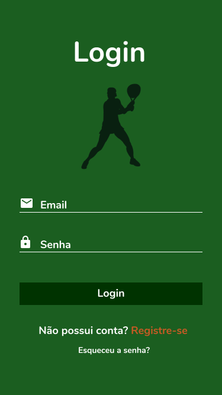](../assets/prototipo/prototipo_1.png) 

### Tela Cadastro 1

[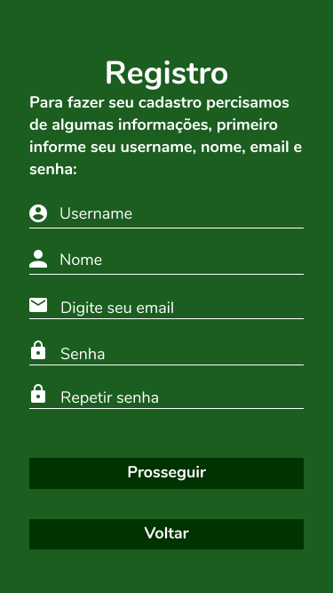](../assets/prototipo/prototipo_2.png) 

### Tela Cadastro 2

[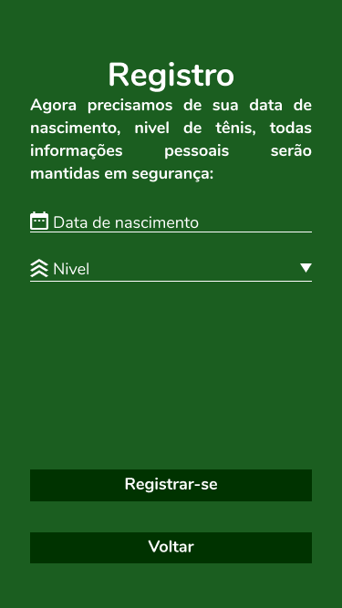](../assets/prototipo/prototipo_3.png) 

### Tela Esqueceu Senha

[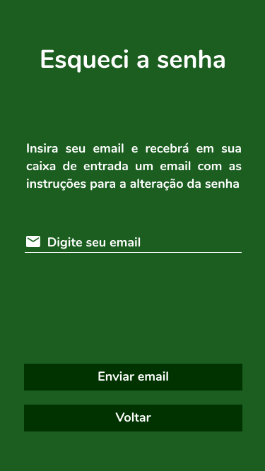](../assets/prototipo/prototipo_4.png)

### Tela do Feed
[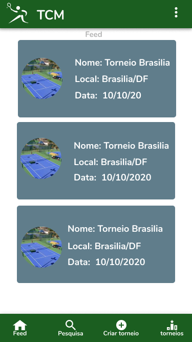](../assets/prototipo/prototipo_5.png)

### Tela Feed com configurações
[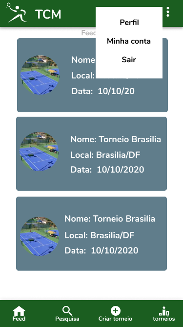](../assets/prototipo/prototipo_6.png)

### Tela Perfil
[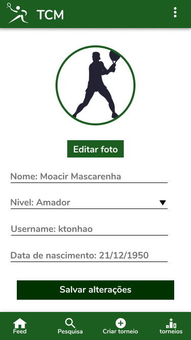](../assets/prototipo/prototipo_7.png)

### Tela Cadastrar torneio 1
[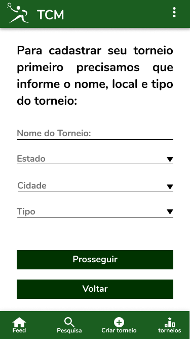](../assets/prototipo/prototipo_8.png) 

### Tela Cadastrar torneio 2

[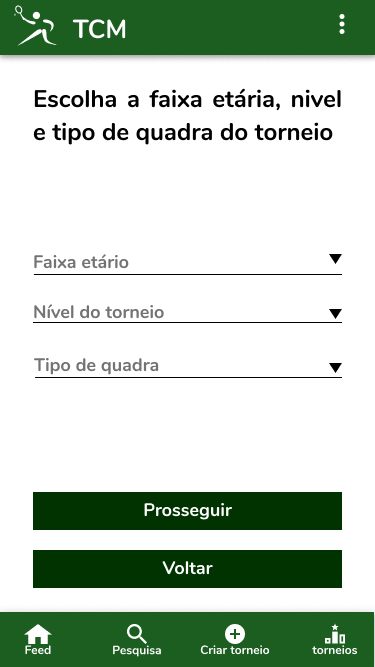](../assets/prototipo/prototipo_9.png) 

### Tela Cadastrar torneio 3
[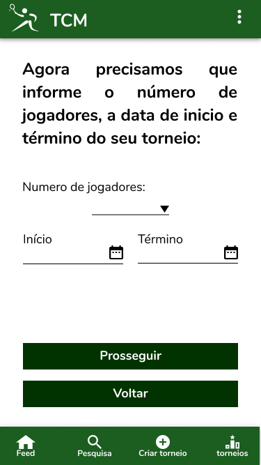](../assets/prototipo/prototipo_10.png)

### Tela Cadastrar torneio 4
[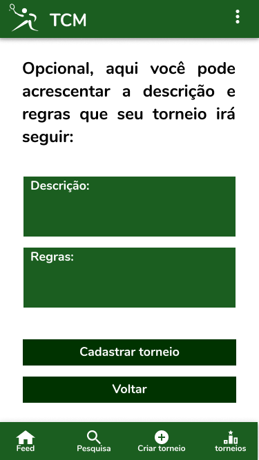](../assets/prototipo/prototipo_11.png)

### Tela com meus torneios
[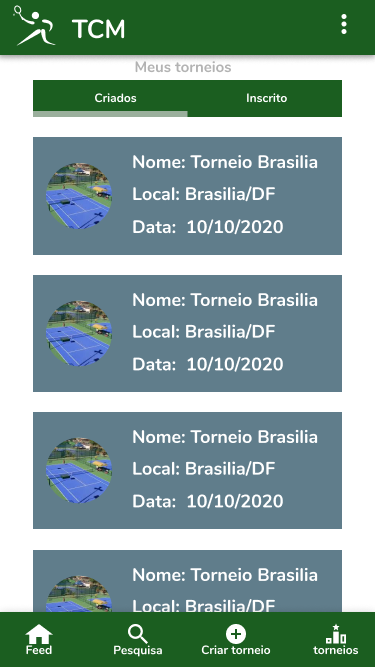](../assets/prototipo/prototipo_12.png)

### Tela de inscrição em torneio
[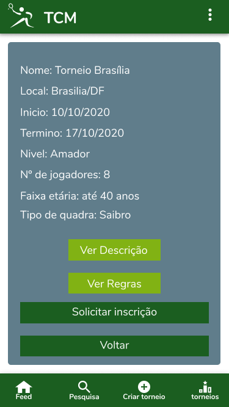](../assets/prototipo/prototipo_13.png) 

Na primeira versão do protótipo utilizamos a ferramenta <a href="https://material.io/resources/color/#!/?view.left=0&view.right=0">Material Design Color Tool</a>  para auxiliar na criação da paleta de cores do aplicativo, definimos as cores base do aplicativo mas as cores definidas para as telas 12 e 13 ainda não foram decididas.

link para o <a href="https://www.figma.com/file/karoCnQtvMXWHEwdMuhQs0/Prototipo?node-id=0%3A1">Protótipo</a> 

## Conclusão

A partir da elaboração do protótipo foi possível ter uma noção inicial da interface do usuário, definindo fluxo, paleta de cores, botões, app bars e diversas outras funcionalidades

## Referências

> Material Design Color Tool. Disponível em:  https://material.io/resources/color/#!/?view.left=0&view.right=0

> PMI. Um guia do conhecimento em gerenciamento de projetos. Guia PMBOK® 5a. ed. EUA: Project Management Institute, 2013.

> Ferramenta Figma. Disponível em https://www.figma.com

## Autor(es)

| Data | Versão | Descrição | Autor(es) |
| -- | -- | -- | -- |
| 07/09/20 | 1.0 | Criação do documento | Lucas Alexandre, Matheus Estanislau  | 
| 07/09/20 | 2.0 | Adicionado as imagens do prótotipo | Lucas Alexandre, Matheus Estanislau  | 
| 07/09/20 | 3.0 | Adicionado conclusão e referências  | Lucas Alexandre, Matheus Estanislau  | 
