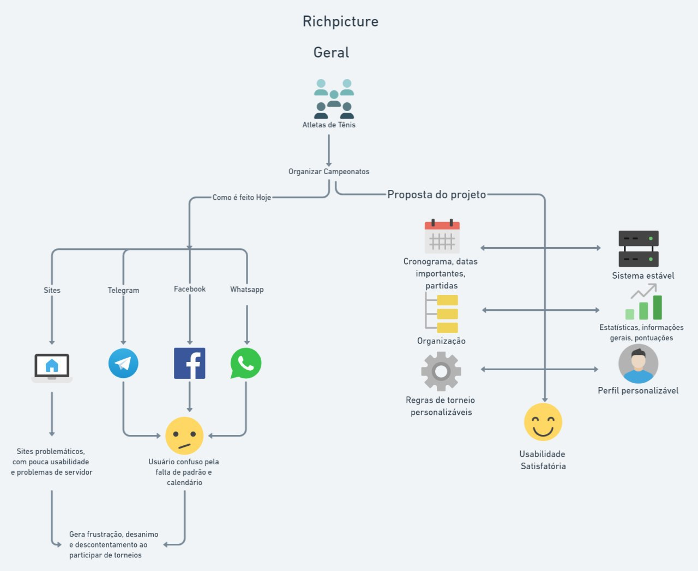

## Introdução

O Rich Picture é uma forma de estruturar ideias abstratas com os objetivos de:

- Compartilhar pensamentos abstratos ou de entendimento geral.
- Permite que seja feito um acordo sobre a interpretação a ser tomada.
- Identificar o problema a ser tratado.
- Desenvolver uma descrição do problema / solução.  

## Metodologia

Para o desenvolvimento dos Rich Pictures foi definido um pareamento onde os autores utilizaram as plataformas Google Hangouts para videoconferência, Whimsical para elaboração dos Rich Picures, Visual Studio Code para elaboração do documento e Live Shared para compartilhamento e edição de documentos.

## Rich Pictures
### Versão 1
### 1. Geral

Aqui foi abordado o problema atual dos jogadores de tênis e possíveis soluções que podem ser abordadas no software, como usabilidade satisfatória, estabilidade de servidores e estatísticas.

### Versão 2

### 2. Geral

## Referências

> Better Evaluation. Rich Pictures. Disponível em https://www.betterevaluation.org/en/evaluation-options/richpictures Acesso em 28/08/20.

> Draw.io. Disponível em: https://app.diagrams.net/
## Versionamento

| Data | Versão | Descrição | Autor(es) |
| -- | -- | -- | -- |
| 28/08/20 | 1.0 | Criação do documento | Matheus Estanislau e Renan Cristyan |
| 11/09/20 | 2.0 | Adicionada versão 2 do rich-picture geral | Moacir Mascarenha |