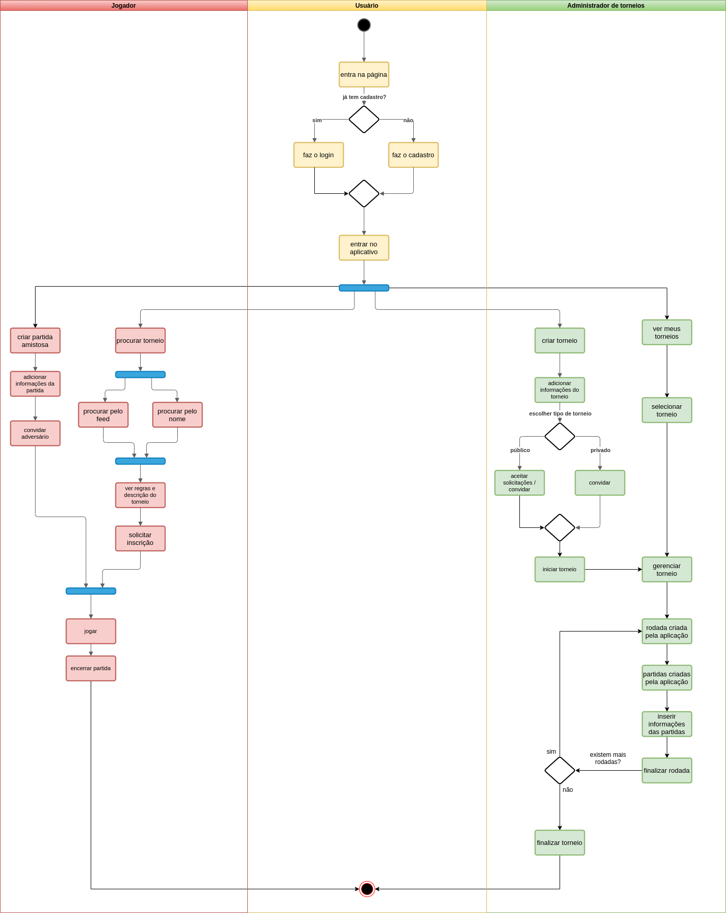

## Introdução

O diagrama de atividades é um fluxo de controle, atividades e objetos que tem como objetivo explicitar as sequências e condições no fluxo geral. Uma atividade é definida como um comportamento parametrizado representado pelo fluxo coordenado de ações.[1]

## Metodologia

Foram levantados as atividades que serão seguidas ao executar o programa na sua versão utilizável. Depois nós discutimos sobre as ligações e o fluxo de atividades, além de seus relacionamentos, e assim geramos o fluxo geral de atividades a serem desempenhadas. Além disso, ao final do processo de elaboração do fluxo, organizamos as ideias e atividades semelhantes em 3 grandes grupos, que são Jogador, Usuário e Administrador de torneios.

Para a elaboração do diagrama de atividades, a equipe utilizou o programa [Draw.io](https://drawio-app.com/) para colaborar em tempo real no diagrama. Além disso, foi utilizado o Google Hangouts para videoconferência e Visual Studio Code / Live Share para elaboração da documentação.

## Diagrama de Atividades

### Versão 1.0

](../assets/Diagrama_atividades/diagrama_de_atividades.png)

## Conclusão

Após a elaboração do diagrama de atividades, a equipe pode ter uma visão geral do fluxo de funcionamento e atividades do sistema. Desta forma, poderemos manter um padrão melhor e utilizar este diagrama como referência para futuras implementações no projeto. Pessoasnão relacionadas ao projeto terão mais facilidade de entender o fluxo de atividades e passos a serem executados no produto final, e assim a colaboração da comunidade será facilitada no futuro.

## Referências

> [1] Activity Diagrams. Disponível em: https://www.uml-diagrams.org/activity-diagrams.html. Acesso em 23/09/20

> [2] Free online diagram software. Disponível em: https://app.diagrams.net/. Acesso em 23/09/20

## Autor(es)

| Data | Versão | Descrição | Autor(es) |
| -- | -- | -- | -- |
| 23/09/20 | 1.0 | Criação do documento | João Pedro e Renan Cristyan |
| 28/09/20 | 1.1 | Ajustes no documento | João Pedro e Renan Cristyan |