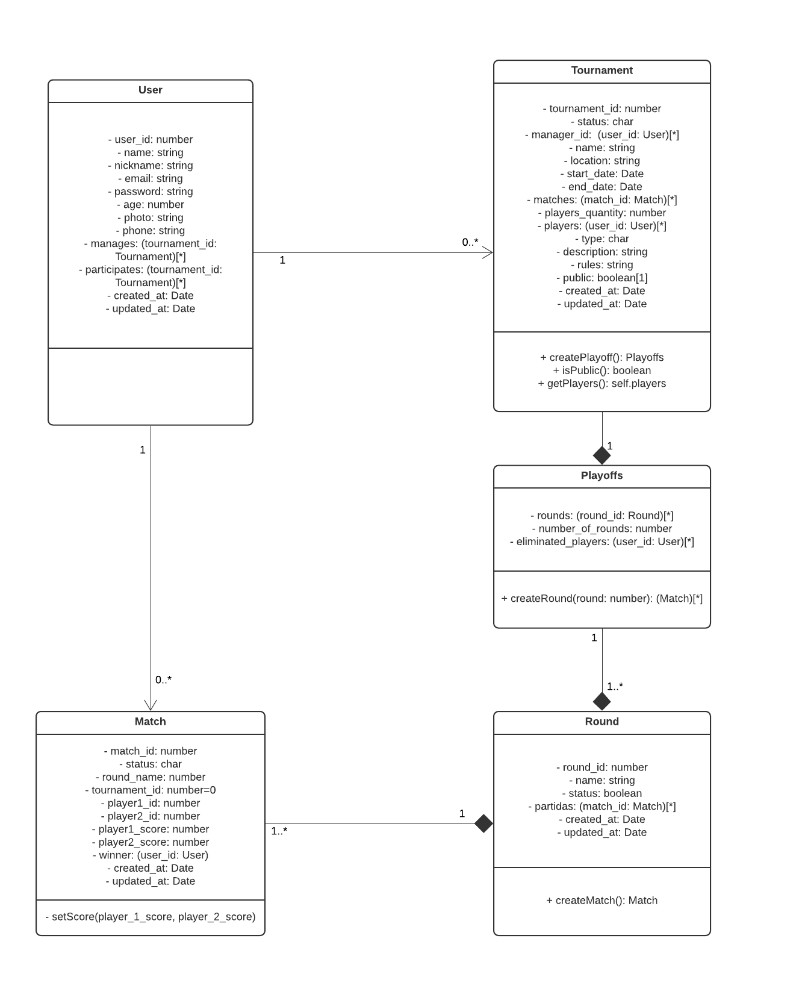

## Introdução

O diagrama de classes UML é um diagrama que mostra a estrutura do sistema desenhado no nível de classes e interfaces, ilustra as funcionalidades, dependências e relacionamentos de cada elemento. Pode ser vista como uma representação visual da arquitetura de um sistema. 

## Metodologia

Para a criação da primeira versão do diagrama de classes, a equipe utilizou o programa [Lucidchart](https://www.lucidchart.com/) para colaborar em tempo real no diagrama. Além disso, foi utilizado o Google Hangouts para videoconferência e Visual Studio Code / Live Share para elaboração da documentação.

## Diagrama de classes

### Versão 1.0

](../assets/diagrama_de_classes/diagrama_de_classes.png)

## Conclusão

Através do diagrama de classes, foi possível representar a estrutura do sistema a nível de classes e auxiliar na modelagem da arquitetura geral, além do banco de dados.

## Referências

> UML Class and Object Diagrams Overview. Disponível em https://www.uml-diagrams.org/class-diagrams-overview.html. Acesso em 21/09/20

> UML Class Diagram Tutorial. Disponível em https://www.youtube.com/watch?v=UI6lqHOVHic. Acesso em 21/09/20

## Autor(es)

| Data | Versão | Descrição | Autor(es) |
| -- | -- | -- | -- |
| 21/09/20 | 1.0 | Criação do documento | João Pedro, Lucas Alexandre, Matheus Estanislau, Moacir Mascarenha e Renan Cristyan |