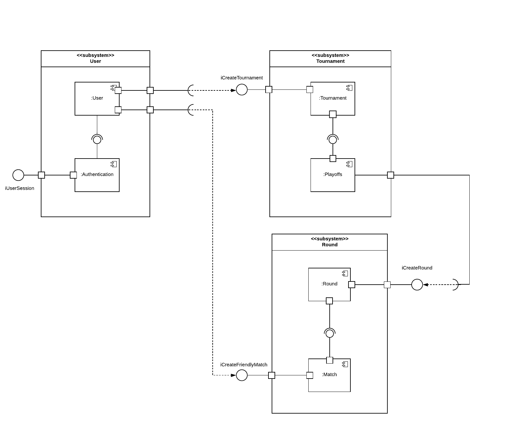

## Introdução

O diagrama de componente é uma representação dos relacionamentos entre os componentes encontrados no sistema, ajudam a equipe a entender a estrutura e o relacionamento dos componentes, tambem facilita na criação de novos componentes. Cada componente é responsável por uma parte do sistema e pode ser visualizado atraves do diagrama seus níveis de funcionalidade.

## Metodologia

Para a elaboração do diagrama foi utilizado o software [Lucidchart](https://www.lucidchart.com). A estrutura é formada por subsistemas, componentes, interface e relações entre os componentes. A interface é representada por um 'i' em frente ao seu nome.

## Diagramas
### Versão 1.0

](../assets/Diagrama_componentes/diagrama_de_componentes.png)

## Conclusão

Com o diagrama de componentes, a equipe tem uma melhor visualização dos componentes e dos conceitos abstratos, além de suas formas de interação. Apesar do projeto ser relativamente simples, a implementação deste documento e do diagrama correspondente serviu como aprendizagem para os membros responsáveis.

## Referências

> Diagrama de componentes UML: o que é, como fazer e exemplos. Disponível em: https://www.lucidchart.com/pages/pt/diagrama-de-componentes-uml Acesso em 21/09/20

> Lucidchart: Um espaço de trabalho visual para equipes remotas. Disponível em: https://www.lucidchart.com/ Acesso em 21/09/20

> UML Port. Disponível em: https://www.uml-diagrams.org/port.html?context=components Acesso em 27/09/20

> UML Structural Diagrams: Component Diagram - Georgia Tech - Software Development Process. Disponível em: https://www.youtube.com/watch?v=ipKJwnPsst8 Acesso em 21/09/20

## Autor(es)
| Data | Versão | Descrição | Autor(es) |
| -- | -- | -- | -- |
| 21/09/20 | 1.0 | Criação do documento | João Pedro, Matheus Estanislau e Renan Cristyan | 
| 27/09/20 | 1.1 | Correções no documento | Renan Cristyan | 