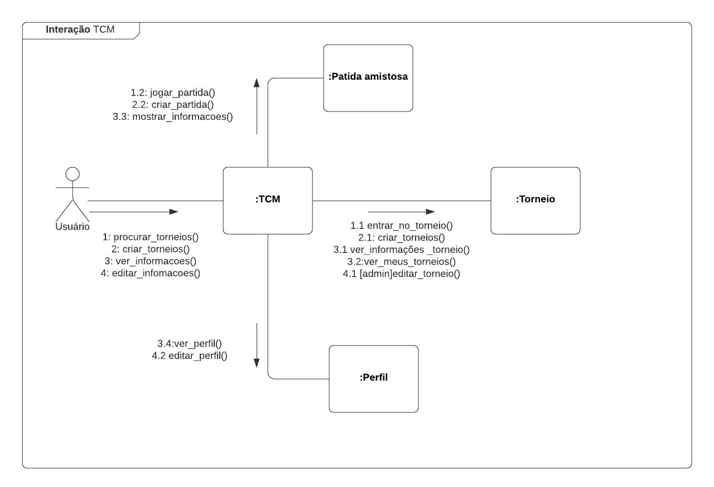
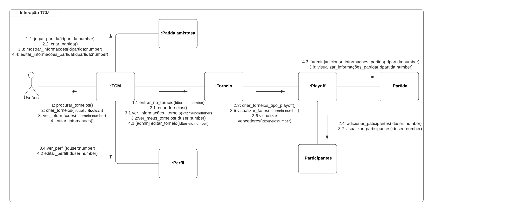

## Introdução

O diagrama de comunicação é um tipo de diagrama de interação UML que mostra as interações entre objetos e / ou partes usando mensagens que podem ser trocados entre eles, sequenciadas, em um arranjo de forma livre. Tem o intuito de mostrar como os objetos interagem para executar o comportamento de parte de um caso de uso específico.

## Metodologia

Primeiramente os autores analizaram os casos de uso do projeto, tiveram uma discussão e decidiram as interações que são mais importantes para o sistema, e assim representaram através do diagrama.

Para a criação da primeira versão do diagrama de comunicação, a equipe utilizou o programa <a href="https://www.lucidchart.com/">Lucidchart</a> para colaborar em tempo real no diagrama. Além disso, foi utilizado o Google Hangouts para videoconferência e Visual Studio Code / Live Share para elaboração da documentação.

## Diagrama de Comunicação

### Versão 1.0

](../assets/diagrama_comunicacao/diagrama_comunicacao.png)

## Versão 2.0 

Para a segunda versão deste diagrama foi usado como base a [versão 2 do diagrama de classes](./diagrama_de_classes.md), os participantes discutiram através de uma reunião, sobre as mudanças necessárias para que se adeque aos padrões utilizados no diagrama de classes. Também foi levado em consideração os questionamentos da avaliação do ponto de controle 2, como adição dos parâmetros aos métodos e aumento do escopo

](../assets/diagrama_comunicacao/diagrama_comunicacao2.png)

#### Rastreabilidade de Requisitos

| ID|Descrição|
|---|---|
|US12, US13, US15 |Usuário|
|US17, US18, US19, US33, US40|Torneio|

## Conclusão

Com o diagrama de comunicação, podemos observar as interações dos objetos e partes compostas no sistema e assim obter um melhor entendimento dessas relações e comportamentos.

## Referências

> UML Communication Diagrams Overview em: https://www.uml-diagrams.org/communication-diagrams.html. Acesso em 24/09/20

> What is UML Collaboration Diagram. Disponivel em: https://www.visual-paradigm.com/guide/uml-unified-modeling-language/what-is-uml-collaboration-diagram/

## Autor(es)

| Data | Versão | Descrição | Autor(es) |
| -- | -- | -- | -- |
| 24/09/20 | 1.0 | Criação do documento | João Pedro e Lucas Alexandre |
|28/09/20|1.1| Adicionado rastro| Lucas Alexandre e Moacir Mascarenha |
|28/09/20|1.2| Ajustes na metodologia | João Pedro e Renan Cristyan |
|16/10/20| 2.0 | Adicionada a versão 2.0 do diagrama| João Pedro e Lucas Alexandre |