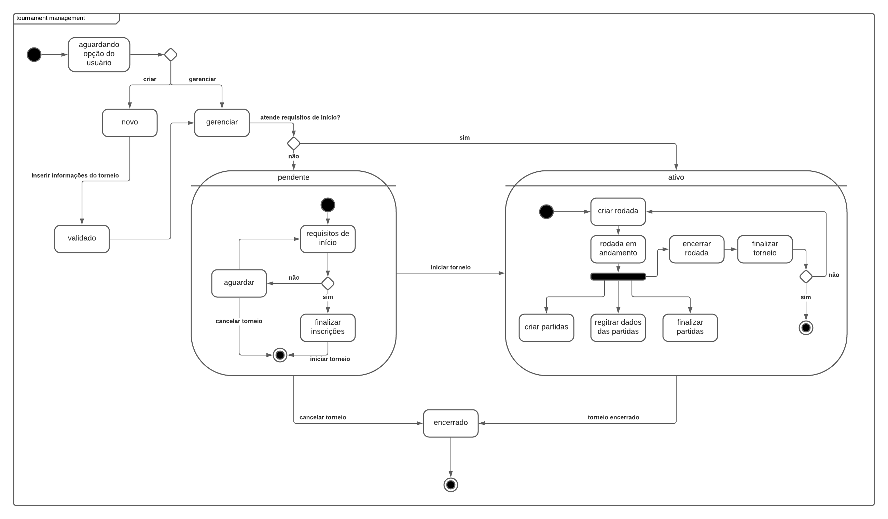
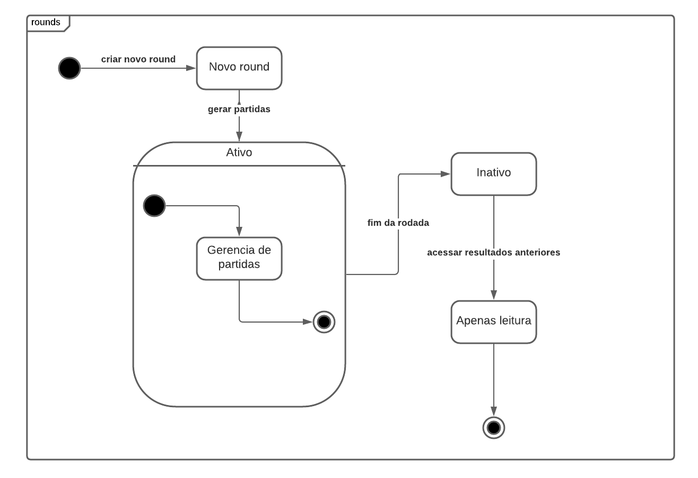
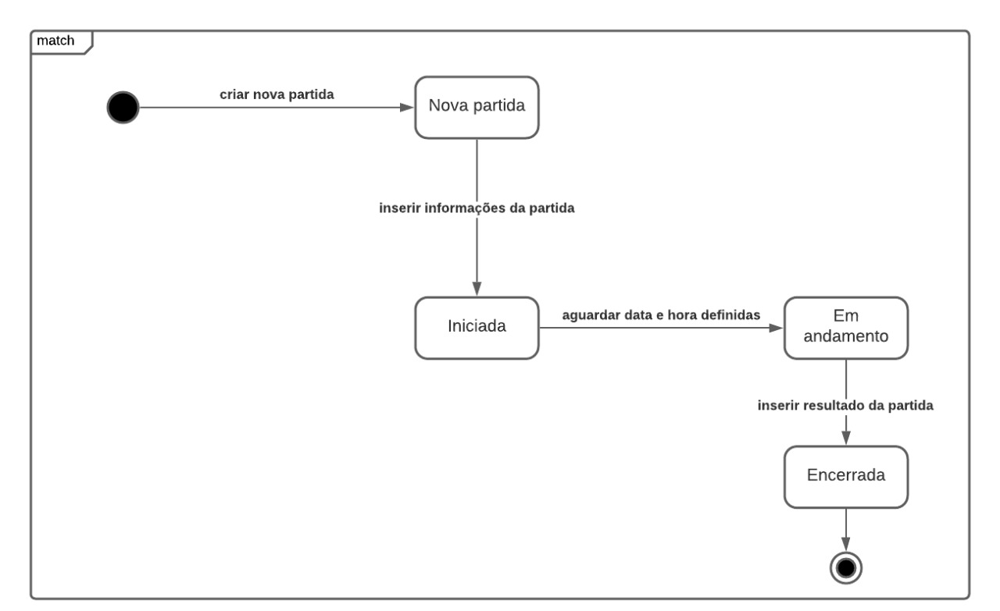

## Introdução

O diagrama de estados busca representar as várias transições de estados que uma determinada parte do sistema pode passar. Ao decorrer da execução do sistema, os estados podem variar quando ocorrem eventos internos ou externos. O diagrama de estados visa documentar estas variações.

## Metodologia

Inicialmente, buscou-se identificar as partes ou processos do sistema a serem ilustrados. Depois, procuramos os estados associados aquele contexto e suas variações, dependendo de eventos internos ou externos. Assim, pudemos representar um conceito bastante abstrato na forma de um diagrama que pode ser utilizado para referências futuras.

Foi utilizado os softwares Lucidchart e Draw.io para a implementação dos diagramas, Google Hangouts para videoconferência, Google Drive para compartilhamento de imagens e Visual Studio Code com extensão Live Share para elaboração do documento.

## Diagrama de Estados

### Versão 1.0

#### Gerenciamento de torneio

#### Rodada

#### Partida

## Conclusão

Através do diagrama de estados, foi possível representar na forma de diagramas e figuras os diferentes estados que os processos Rodada, Partida e Gerenciar Torneio podem passar.

## Referências

> State Machine Diagrams. Disponível em: https://www.uml-diagrams.org/state-machine-diagrams.html Acesso em 27/09/20

> O que é um diagrama de máquina de estados?. Disponível em:  https://www.lucidchart.com/pages/pt/o-que-e-diagrama-de-maquina-de-estados-uml Acesso em 27/09/20

## Autor(es)
| Data | Versão | Descrição | Autor(es) |
| -- | -- | -- | -- |
| 27/09/20 | 1.0 | Criação do documento | Moacir Mascarenha e Renan Cristyan | 