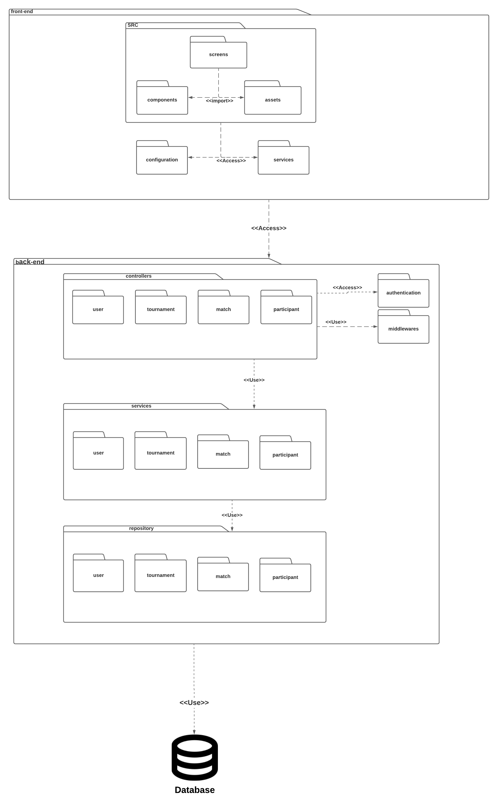
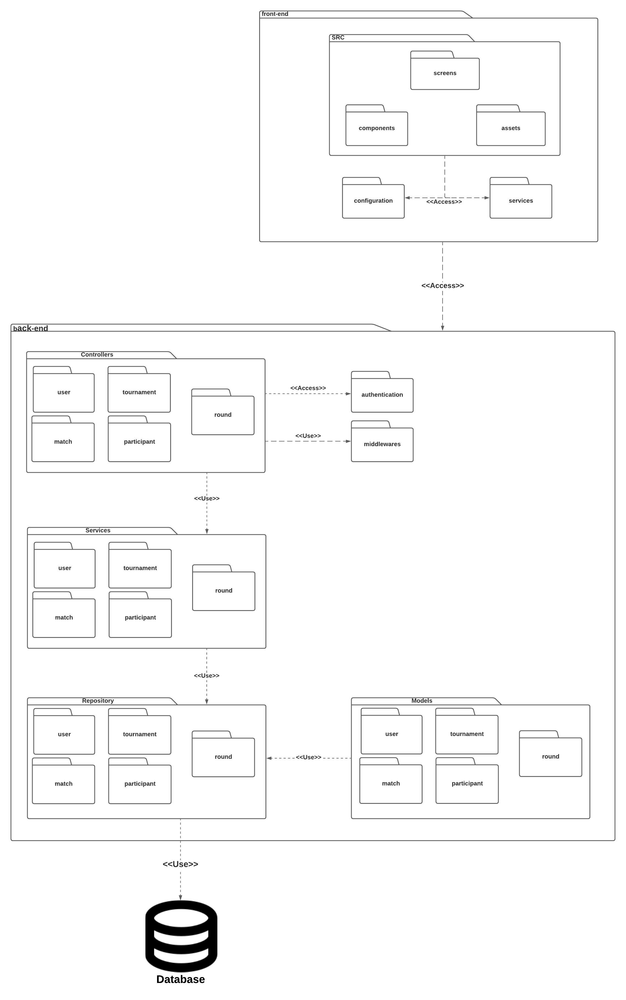

## Introdução

<p align = "justify">
O diagrama de pacotes é um diagrama estrutural utilizado para mostrar, em pacotes, a disposição e organização dos elementos de modelos. Pacotes são agrupamentos de elementos UML relacionados. Cada elemento é colocado dentro do pacote sendo representado como uma pasta de arquivos no diagrama.

</p>

## Metodologia

Inicialmente foi feito um brainstorming, e divido o sistema em dois pacotes, frontend e backend, e dentro de cada um desses foi feito subdivisões de pacotes. Além disso, foi determinado as formas de interações internas e externas entre os pacotes, cada relacionamento sendo devidamente documentado no diagrama a seguir.

Foi utilizado o [Lucidchart](http://lucidchart.com/) para a elaboração do diagrama de pacote, também foi usado a plataforma Hangouts, da Google, para realização da videoconferência para discussão da estrutura do diagrama, Visual Studio Code com extensão liveshare para confecção do documento.

## Diagrama de Pacotes

### Versão 1.0

](../assets/Diagrama_pacotes/Diagrama_de_pacote.png)

### Versão 2.0 
<p align = "justify">
Na segunda versão foram adicionadas as camadas de services, controllers e repository e, também, foram incluidas as classes de usuário, torneio, participantes e partida. 

</p>

](../assets/Diagrama_pacotes/Diagrama_de_pacote2.png)

```Autores: Lucas Alexandre, Matheus Estanislau e Moacir Mascarenha ```

### Versão 3.0 

Na terceira versão foi adicionada a camada model e também foi incluído a classe round nas camadas controller, services, repository, model e partida, o ponto de acesso ao banco de dados também foi refatorado, a camada repository é a única que possui acesso ao banco de dados. 

](../assets/Diagrama_pacotes/Diagrama_de_pacote3.png)

```Autores: Lucas Alexandre e Matheus Estanislau```

## Conclusão

<p align = "justify">
A partir da elaboração do diagrama de pacotes foi possível ter uma visão geral do projeto e de sua organização em maior escala. Com o diagrama de pacotes implementado, a equipe tem uma base arquitetural de como estruturar os elementos de frontend e backend, e assim manter tudo padronizado e documentado.
</p>

## Referências

> Tudo sobre diagramas de pacotes UML, disponível em: https://www.lucidchart.com/pages/pt/diagrama-de-pacotes-uml

## Autor(es)

| Data | Versão | Descrição | Autor(es) |
| -- | -- | -- | -- |
| 21/09/20 | 1.0 | Criação do documento | Lucas Alexandre, Matheus Estanislau e Moacir Mascarenha | 
| 28/09/20 | 1.1 | Ajustes na metodologia e conclusão | João Pedro, Matheus Estanislau e Renan Cristyan | 
|24/10/20| 2.0 | Adicionada a versão 2.0 do diagrama de pacotes| Lucas Alexandre|
|25/10/20| 2.0 | Adicionada a versão 3.0 do diagrama de pacotes| Lucas Alexandre e Matheus Estanislau|

