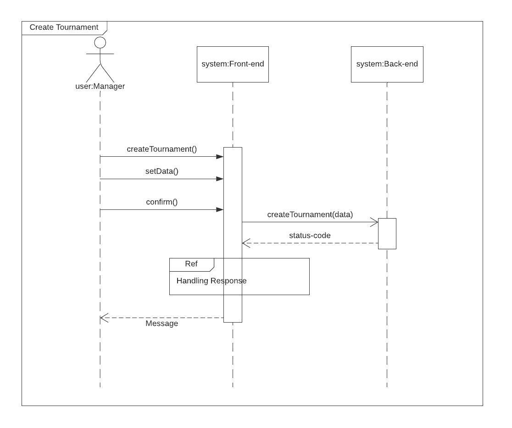
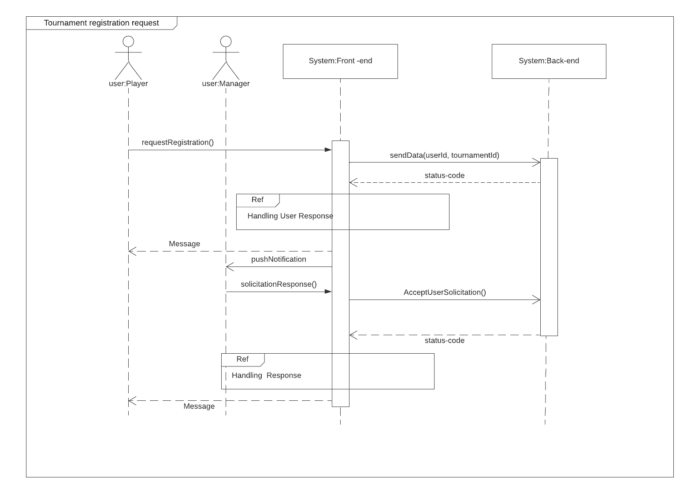
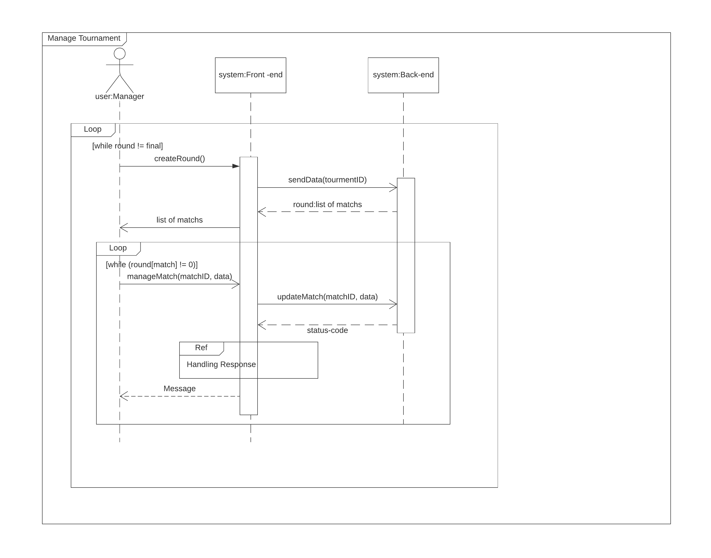

## Introdução

O diagrama de sequência é utilizado principalmente para ilustrar as interações entre objetos em uma ordem sequencial em que essas interações ocorrem, descrevendo uma interação focado na sequência de mensagens, junto com suas especificações de ocorrência correspondentes nas linhas de vida.

## Metodologia

Foi utilizado o <a href='http://lucidchart.com'>Lucidchart</a> para a elaboração do diagrama de sequência, também foi usado a plataforma Hangouts, da Google, para realização da videoconferência para discussão da estrutura do diagrama, Visual Studio Code com extensão liveshare para confecção do documento.

## Diagramas

### Versão 1.0
### Criação de torneio

](../assets/Diagrama_sequencia/sequencia1.png)

### Solicitação de inscrição no torneio

](../assets/Diagrama_sequencia/sequencia2.png)

### Gerenciamento do torneio

](../assets/Diagrama_sequencia/sequencia3.png)

## Conclusão

O diagrama de sequência permite a fácil identificação das etapas e suas interações em determinados processos, auxiliando a equipe de desenvolvimento a entender como os objetos interagem e o funcionamento dentro do negócio. 

## Referências

> UML Sequence Diagrams, disponível em: https://www.uml-diagrams.org/sequence-diagrams.html

> The sequence diagram, disponível em: https://developer.ibm.com/technologies/web-development/articles/the-sequence-diagram/

## Autor(es)

| Data | Versão | Descrição | Autor(es) |
| -- | -- | -- | -- |
| 26/09/2020 | 1.0 | Criação do documento | Moacir Mascarenha e Matheus Estanislau | 
