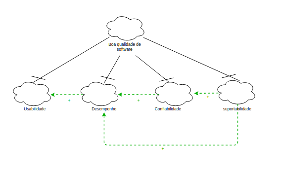
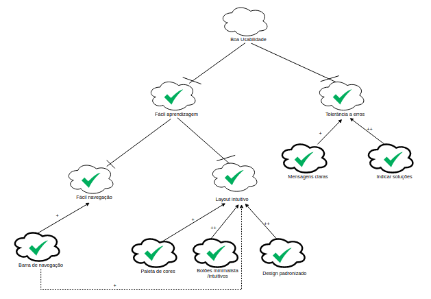
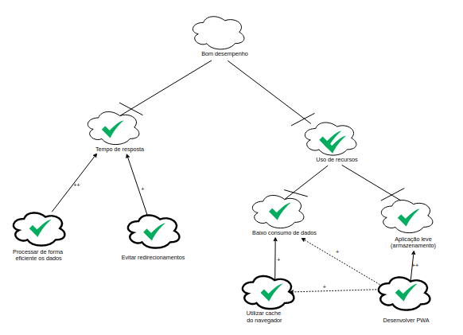
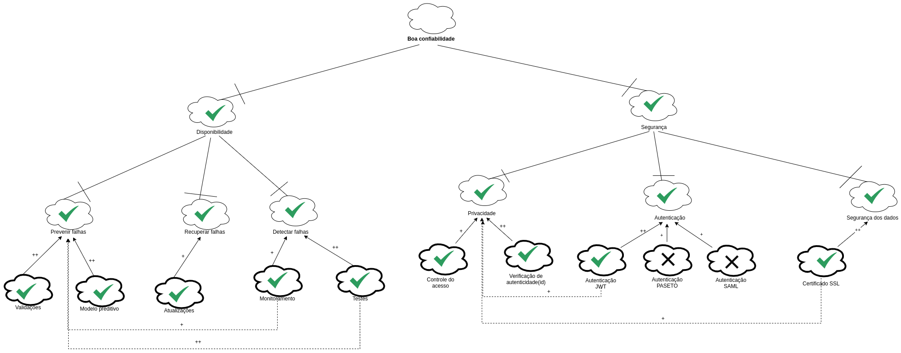

## Introdução

O NFR Framework trata-se de um framework conceitual orientado a requisitos não funcionais, ele decompõe os requisitos facilitando assim a compreensão e a priorização destes requisitos.

## Metodologia

Para a criação da primeira versão do NFR, a equipe utilizou o programa <a href="https://app.diagrams.net/">draw.io</a> para colaborar em tempo real. Além disso, foi utilizado o Google Hangouts para videoconferência e Visual Studio Code / Live Share para elaboração da documentação.

## Diagramas

## NFR00 - Geral 

| NFR00 | Atores |  
|--|--|
|Versão| 1.0 | 
|**Data**| 17/09/2020 |
|**Hora**| 10h42 |
|**Autor(es)**| Lucas Alexandre e Moacir Mascarenha |

## NFR01 - Usabilidade 

| NFR01 | Atores |  
|--|--|
|Versão| 1.0 | 
|**Data**| 17/09/2020 |
|**Hora**| 11h10 |
|**Autor(es)**| Lucas Alexandre e Moacir Mascarenha |

## NFR02 - Desempenho 

| NFR02 | Atores |  
|--|--|
|Versão| 1.0 | 
|**Data**| 21/09/2020 |
|**Hora**| 10h05 |
|**Autor(es)**| Lucas Alexandre e Moacir Mascarenha |

## NFR03 - Confiabilidade 

| NFR02 | Atores |  
|--|--|
|Versão| 1.0 | 
|**Data**| 21/09/2020 |
|**Hora**| 10h37 |
|**Autor(es)**| Lucas Alexandre e Moacir Mascarenha |

## Conclusão

## Referências

> Enhancing Data Warehouse Design with the NFR Framework. Disponível em: http://wer.inf.puc-rio.br/wer02/zip/Enhancing_Data(4).pdf
 

## Autor(es)

| Data | Versão | Descrição | Autor(es) |
| -- | -- | -- | -- |
| 27/09/2020 | 1.0 | Criação do documento | Lucas Alexandre, Moacir Mascarenha | 