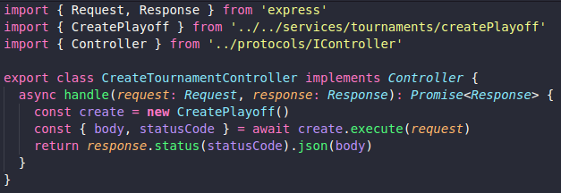
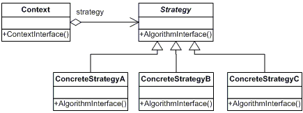
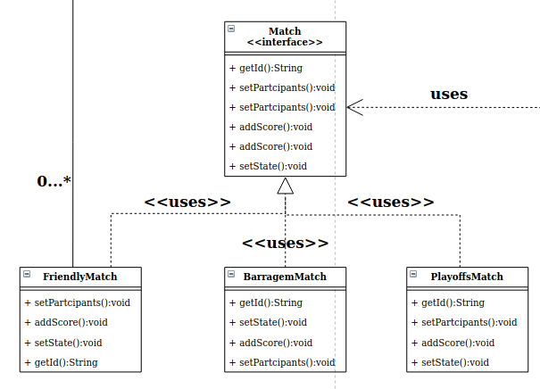
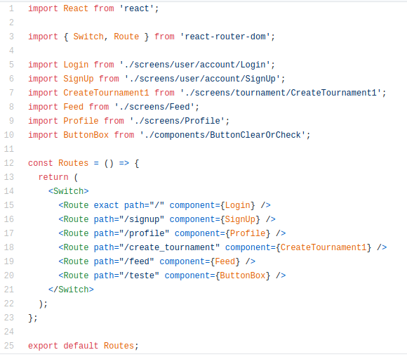
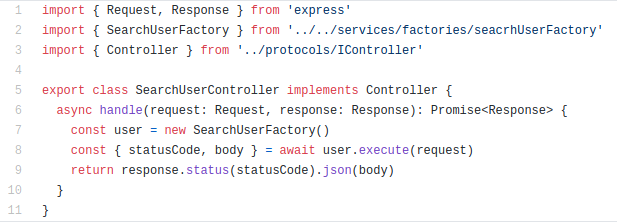

## Introdução

Os padrões comportamentais se concentram nos algoritmos e atribuições de responsabilidades entre os objetos. Eles não descrevem apenas padrões de classes ou de objetos, mas também os padrões de comunicação entre os objetos. Ao fazer isso, esses padrões aumentam a flexibilidade na realização dessa comunicação [4].

## Metodologia

 A partir do estudo da equipe sobre os padrões comportamentais e feedback das avaliações, a equipe analisou os diagramas identificando problemas onde os padrões poderiam ser aplicados. A partir desses padrões identificados, a equipe os implementou.

## Padrões Comportamentais

### Versão 1.0

## Chain of responsability

O Chain of Responsibility é um padrão de projeto comportamental que permite que você passe pedidos por uma corrente de handlers. Ao receber um pedido, cada handler decide se processa o pedido ou o passa adiante para o próximo handler na corrente [1].

Exemplo:

### Motivação

Foi usado o padrão Chain of Responsibility a partir de metodos handlers, para que a partir da request a controller decida qual service deverá realizar a função desejada. Assim reduzindo o grau de acoplamento e com maior flexibilidade.

### Aplicação no projeto

Na imagem abaixo encontra a controller de torneio em que contém o padrão chain of responsability na funçao handle que instancia a classe CreatePlayoff

## Strategy

O padrão comportamental Strategy permite a criação de uma família de algorítmos, separá-los em classes e fazer objetos intercambiáveis [5]. 

Uma vantagem em se aplicar este padrão é que se torna possível criar uma interface contendo determinados métodos, e classes que implementam esses métodos de maneira independente, facilitando a manutenabilidade do sistema. 

### Motivação

A ideia de se utilizar o padrão comportamental Strategy foi para abstrair a lógica de uma partida (match), já que uma partida pode ser amistosa, de mata-mata, de barragem ou de muitos tipos diferentes de torneio. Ao utilizar o padrão, cada tipo de partida implementa em sua própria classe os mesmos métodos determinados por uma interface.

### Aplicação no projeto

No diagrama de classes, foi implementada uma interface Match que contém métodos comuns a todos os tipos de partida. Porém, devido as diferenças entre cada torneio e suas partidas, foi criada uma classe por partida diferente, e cada classe implementa os métodos da interface Match. A aplicação do padrão Strategy contribuiu fortemente para a manutenabilidade do sistema, além de permitir que o mesmo se expanda com facilidade no futuro. 

## Mediator

O Mediator é um padrão de projeto comportamental que permite que você reduza as dependências caóticas entre objetos. O padrão restringe comunicações diretas entre objetos e os força a colaborar apenas através do objeto mediador [1].

### Motivação

A partir do padrão de projeto Repository Pattern é possivel observar a aplicação do padrão GoF representada pela controller que faz mediação entre a camada de view e service. Para o frontend usamos o padrão de rotas para acesso as paginas do sistema sendo assim um mediator.

### Aplicação no projeto

O padrão Mediator foi aplicado tanto no Backend da aplicação (na implementação dos controllers), quanto no Frontend (os conceitos de mediaçao foram aplicados nas lógicas das rotas). 

Aplicação no Frontend

Aplicação no Backend

## Strategy

O padrão comportamental Strategy permite a criação de uma família de algorítmos, separá-los em classes e fazer objetos intercambiáveis [5]. 

Uma vantagem em se aplicar este padrão é que se torna possível criar uma interface contendo determinados métodos, e classes que implementam esses métodos de maneira independente, facilitando a manutenabilidade do sistema. 

### Motivação

A ideia de se utilizar o padrão comportamental Strategy foi para abstrair a lógica de uma partida (match), já que uma partida pode ser amistosa, de mata-mata, de barragem ou de muitos tipos diferentes de torneio. Ao utilizar o padrão, cada tipo de partida implementa em sua própria classe os mesmos métodos determinados por uma interface.

### Aplicação no projeto

No diagrama de classes, foi implementada uma interface Match que contém métodos comuns a todos os tipos de partida. Porém, devido as diferenças entre cada torneio e suas partidas, foi criada uma classe por partida diferente, e cada classe implementa os métodos da interface Match. A aplicação do padrão Strategy contribuiu fortemente para a manutenabilidade do sistema, além de permitir que o mesmo se expanda com facilidade no futuro. 

## Memento

O padrão comportamental Memento permite salvar e restaurar o estado de um objeto sem revelar os detalhes da sua implementação [1].

### Motivação

### Aplicação no projeto

## Conclusão

## Referências

> [1] PADRÕES de PROJETO. Disponível em: https://refactoring.guru/pt-br/design-patterns Acesso em: 24/10/20

> [2] GAMMA, Erich et al. Design Patterns: Elements of Reusable Object-Oriented Software. 1. ed. Massachusetts: Addison-Wesley Professional, 2009. 426 p. ISBN 0-201-63361-2. Acesso em: 24/10/20

> [3] CONHEÇA OS PADRÕES DE PROJETO. Disponível em: https://www.devmedia.com.br/conheca-os-padroes-de-projeto/957 Acesso em: 24/10/20

> [4] Padrão de projeto de software. Disponível em: https://pt.wikipedia.org/wiki/Padr%C3%A3o_de_projeto_de_software Acesso em: 24/10/20

> [5] Padrão Comportamental Strategy. Disponível em: https://refactoring.guru/pt-br/design-patterns/strategy Acesso em: 24/10/20 

## Autor(es)

| Data | Versão | Descrição | Autor(es) |
| -- | -- | -- | -- |
| 24/10/20 | 1.0 | Criação do documento | João Pedro e Lucas Alexandre |
|24/10/20 | 1.1| Adicionado o padrão Chain of Responsability | João Pedro, Lucas Alexandre e Matheus Estanislau 
| 24/10/20 | 1.2 | Adicionado o padrão Strategy | Renan Cristyan 
| 25/10/20 | 1.3 | Adicionado exemplo do padrão Strategy | Renan Cristyan
| 25/10/20 | 1.4 | Adicionado o padrão Mediator | João Pedro e Renan Cristyan
| 25/10/20 | 1.5 | Adicionados exemplos do padrão Mediator | João Pedro e Renan Cristyan
