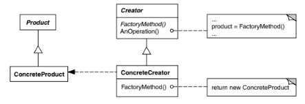
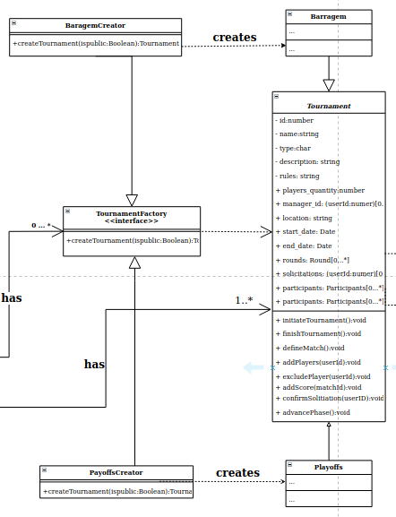

## Introdução

 Os padrões de criação fornece vários mecanismos de criação de objetos, delegando a instanciação para outro objeto, que aumentam a flexibilidade, independência do sistema e reutilização de código já existente.

## Metodologia

A partir do estudo da equipe sobre os padrões criacionais e feedback das avaliações, a equipe analisou os diagramas identificando problemas onde os padrões poderiam ser aplicados.

## Padrões

### Versão 1.0

### Factory Method

O Factory Method (Método fábrica, Construtor virtual) é um padrão criacional de projeto que fornece uma interface para criar objetos em uma superclasse, mas permite que as subclasses alterem o tipo de objetos que serão criados.

#### Motivação
O sistema inicialmente estava projetado para torneios apenas do tipo playoffs, dificultado adições de novos tipos de torneios como o de [barragem](../). Foi usado o padrão Factory Method para flexibilizar o sistema, sendo possível atualizações futuras sem grandes mudanças na base de código.

#### Aplicação no projeto

## Conclusão

Apos a implementação do padrão criacional factory method é possivel notar uma flexibilização do sistema, para possiveis expansões e manutenções futuras sem grandes impactos ao sistema.

## Referências

> [1] PADRÕES de PROJETO. Disponível em: https://refactoring.guru/pt-br/design-patterns 

> [2] GAMMA, Erich et al. Design Patterns: Elements of Reusable Object-Oriented Software. 1. ed. Massachusetts: Addison-Wesley Professional, 2009. 426 p. ISBN 0-201-63361-2.

## Autor(es)

| Data | Versão | Descrição | Autor(es) |
| -- | -- | -- | -- |
| 18/10/20 | 1.0 | Criação do documento | João Pedro e Moacir Mascarenha |
| 18/10/20 | 1.1 | Adicionado Padrão Method | João Pedro, Matheus Estanislau, Moacir Mascarenha |
| 19/10/20 | 1.2 | Atualizada imagem do padrão Factory Method | Renan Cristyan |
