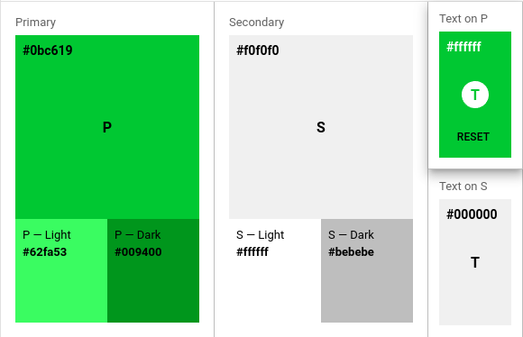

 
 
## Introdução
 
<p align = "justify">
O Guia de Estilo tem o objetivo de estabelecer padrões dentro do projeto , definindo regras e diretrizes que visam garantir a consistência da criação do desenho da interface com o usuário, também tem como objetivo organizar e padronizar o estilo do código fornecendo uma maior legibilidade e compreensividade.
</p>
 
## Metodologia
 
<p align = "justify">
A equipe decidiu por usar o padrão de estilo da biblioteca do <a href="https://material-ui.com">Material Ui</a> para os componentes da aplicação e para as regras de interface. Para o estilo do código foi decidido utilizar a bilioteca de lint <a href="https://eslint.org/">Eslint</a> com o padrão estabelicdo pela <a href="https://github.com/airbnb/javascript">Airbnb</a> Para a criação do documento, a equipe utilizou o Google Hangouts para videoconferência e Visual Studio Code / Live Share para elaboração da documentação.
</p>
 
## Guia de estilo
 
### Versão 1.0
 
### Javascript
Para a padronização de código utilizamos a biblioteca eslint com o padrão da airbnb, porém algumas alterações foram definidas pela equipe, assim utilizamos um script do EsLint para que essa padronização seja verificada em todo o código, quando alguma alteração é feita. Caso as regras de estilo do código não sejam atendidas a inserção do código será negada.
 
### Intaface
 
#### Paleta de cores
 

 
Para representação dos erros utilizar seguintes cores:
 
```
error:
light:
#e57373
main:
#bd2020
dark:
#d32f2f
contrastText:
#fff
```
 
#### Tipografia
Utilizar tipografia padrão do material UI que vão desde o h1 até o body2
 
```
fontFamily: ""Roboto", "Helvetica", "Arial", sans-serif"
h1
h2
h3
h4
h5
h6
subtitle1
subtitle2
body1
body2
```
 
#### Sombreamento
Utilizar os padrões do material UI que vão do 0 ao 5:
```
shadows:
0: "none"
1: "0px 2px 1px -1px rgba(0,0,0,0.2),0px 1px 1px 0px rgba(0,0,0,0.14),0px 1px 3px 0px rgba(0,0,0,0.12)"
2: "0px 3px 1px -2px rgba(0,0,0,0.2),0px 2px 2px 0px rgba(0,0,0,0.14),0px 1px 5px 0px rgba(0,0,0,0.12)"
3: "0px 3px 3px -2px rgba(0,0,0,0.2),0px 3px 4px 0px rgba(0,0,0,0.14),0px 1px 8px 0px rgba(0,0,0,0.12)"
4: "0px 2px 4px -1px rgba(0,0,0,0.2),0px 4px 5px 0px rgba(0,0,0,0.14),0px 1px 10px 0px rgba(0,0,0,0.12)"
5: "0px 3px 5px -1px rgba(0,0,0,0.2),0px 5px 8px 0px rgba(0,0,0,0.14),0px 1px 14px 0px rgba(0,0,0,0.12)"
```
 
#### Pontos de Quebra
 
Os pontos de quebras das telas:
 
```
keys:
0: "xs"
1: "sm"
2: "md"
3: "lg"
4: "xl"
values:
xs: 0
sm: 600
md: 960
lg: 1280
xl: 1920
```
 
#### Bordas
 
Utilizar padrão estipulado de 5px utilizado no protótipo
 
```
borderRadius: 5
```
 
 
## Conclusão
 
<p align = "justify">
Após a elaboração do documento a equipe possui uma padronização da interface e do código, a equipe deve seguir os padrões para uma melhor consistência e qualidade do software, evitando fugas de estilo e mantendo a coesão e legibilidade do código.
</p>
 
## Referências
 
>Guia de Estilo de Usabilidade do Software. Disponivel em: https://homepages.dcc.ufmg.br/~clarindo/arquivos/disciplinas/eu/material/exemplos/geusw-exemplo-incompleto.pdf
 
>Biblioteca de componentes React para um desenvolvimento ágil e fácil. Disponivel em: https://material-ui.com/
 
>Airbnb JavaScript Style Guide. Disponivel em: https://github.com/airbnb/javascript
 
> Find and fix problems in your JavaScript code. Disponivel em: https://eslint.org/
 
## Autor(es)
| Data | Versão | Descrição | Autor(es) |
| -- | -- | -- | -- |
| 03/10/20 | 1.0 | Criação do documento | João Pedro, Matheus Estanislau |
| 03/10/20 | 1.1 | Adicionado regra JavaScript | João Pedro, Matheus Estanislau |
| 03/10/20 | 1.2 | Adicionado regras de Interface | João Pedro, Matheus Estanislau | 
| 03/10/20 | 1.3 | Adicionado conclusão | João Pedro, Matheus Estanislau | 
