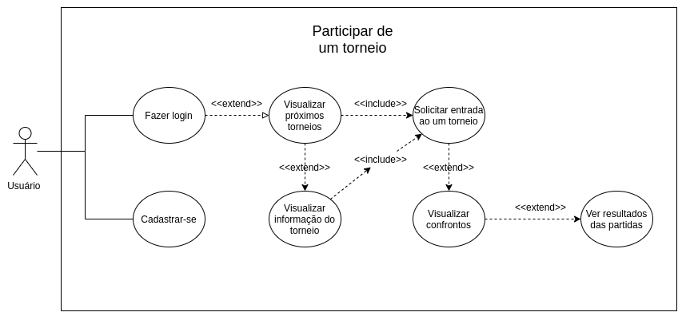
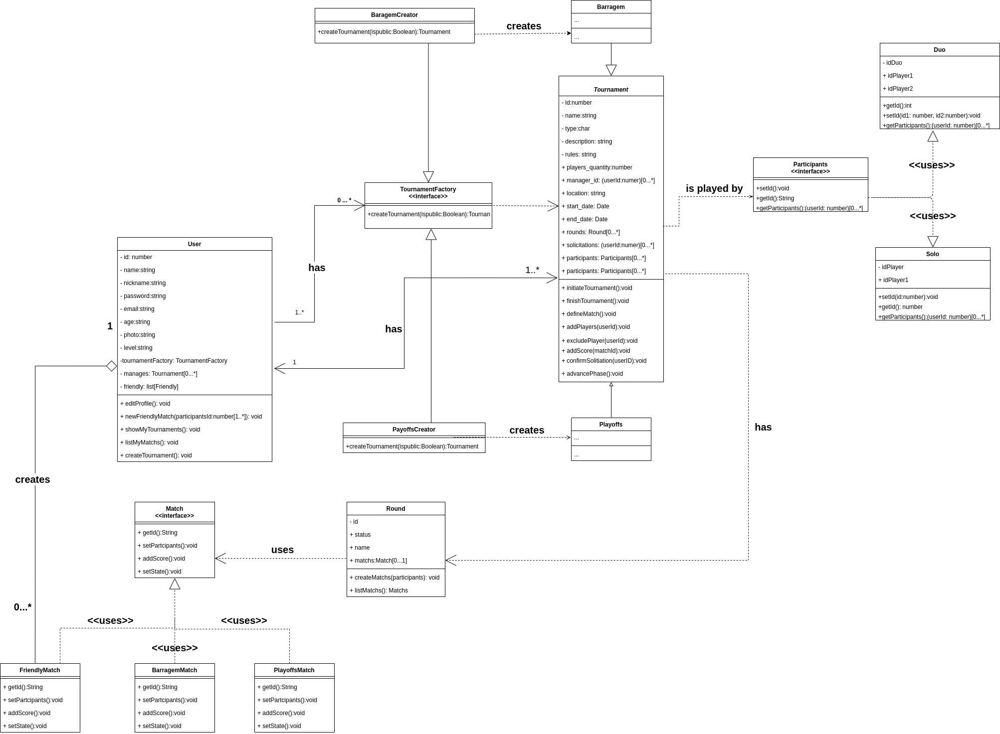
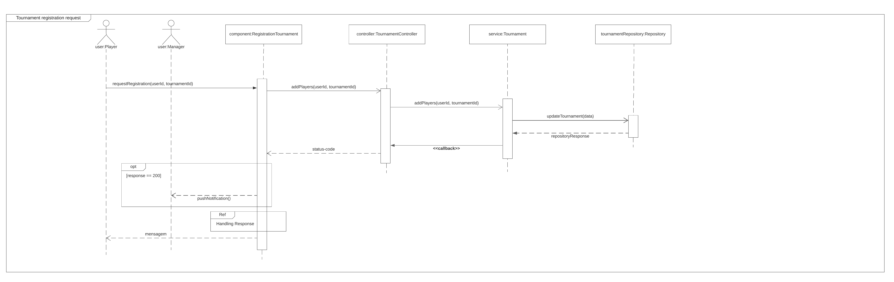
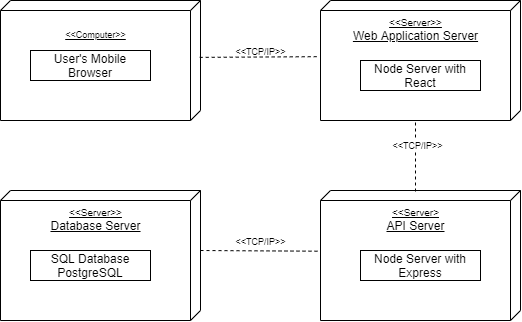
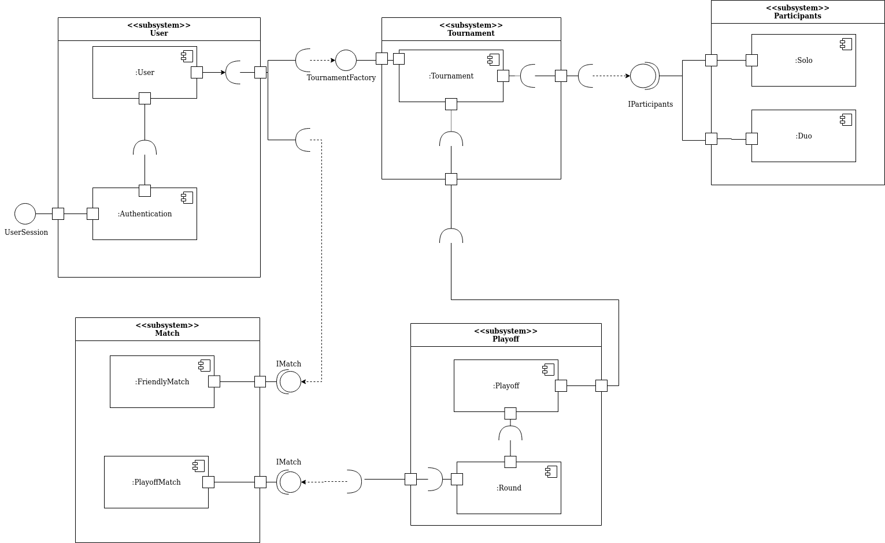
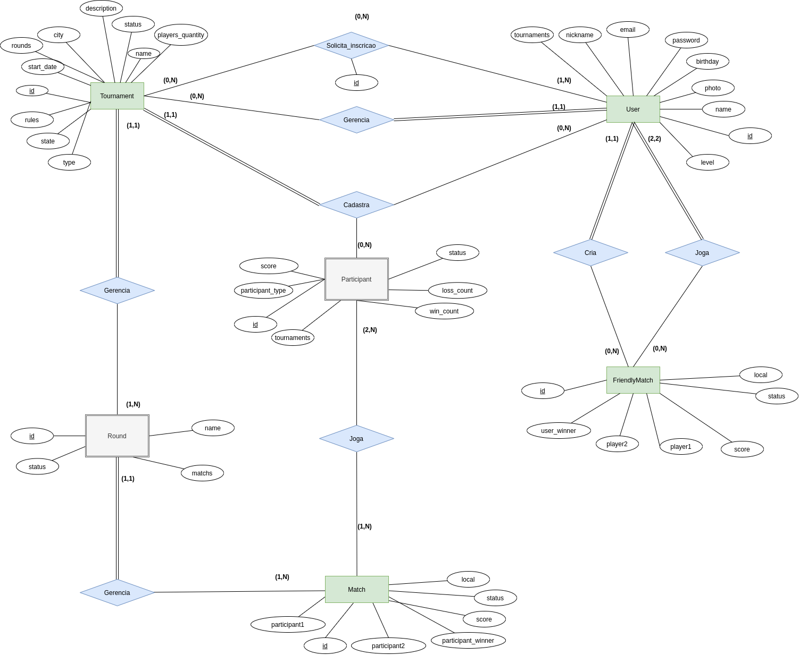

 
# Documento de Arquitetura de Software (DAS)
# TCM
 
# Introdução
## Proposta

Este documento apresenta uma visão geral da arquitetura do sistema, utilizando diferentes visões arquiteturais para destacar diferentes aspectos do sistema. É utilizado para capturar as decisões arquiteturais significativas que fizeram parte do sistema.

 
## Escopo

A aplicação TCM tem o objetivo fornecer aos atletas e esportistas uma ferramenta que possa facilitar a criação, gerenciamento e organização de partidas, torneios e competições de tênis amadoras. Os atletas poderão se inscrever em diversos campeonatos disponíveis e terão acesso às informações de forma clara e objetiva sobre os torneios e partidas que estão envolvidos.

 
## Definições, Acrônimos e Abreviações
 
- MVC - Model, View, Controller
- PWA - Progressive Web App
- TCM - Tennis Cup Management
 
## Visão Geral

O Documento de Arquitetura de Software (DAS) trata-se de uma visão geral de toda a arquitetura do sistema, observando diferentes aspectos do mesmo. Neste documento serão abordadas as seguintes visões da aplicação TCM:

 
- Caso de Uso;
- Lógica;
- Implantação;
- Implementação;
- Dados;
 
# Representação Arquitetural
## Cliente-Servidor

Cliente-Servidor é um modelo de arquitetura que divide as tarefas do sistema entre os fornecedores de um recurso, denominados servidores, e os requerentes do recurso, denominados clientes.Neste projeto utilizamos a arquitetura Cliente-Servidor divido em camadas baseadas no modelo MVC (Model, View, Controller), com a adição de mais uma camada: Service.

 
Cliente (Frontend):
 
- View: Consiste nas partes que interagem com o usuário, exibem informações, formulários, botões, etc. A camada fornece uma interface permitindo solicitar serviço ao servidor e exibir a respostas para o usuário.
 
Servidor (Backend):
 
- Controller: faz a conexão entre as camadas, recebe os dados do usuário na camada View e os envia para a camada Model. Pode implementar lógicas internas para tomar decisões, direcionar os dados, etc.
 
- Service: Responsável pela lógica de negócio da aplicação e por se comunicar com a camada de dados.
 
- Model: Responsável pela persistência de dados no banco e pela comunicação com o banco, desde a consulta até a manipulação de informações.
 
 
# Objetivos de Arquitetura e Restrições
## Objetivos

Segurança:
   JWT: JSON Web Token é um método RCT 7519 padrão da indústria para realizar autenticação entre duas partes por meio de um token assinado que autentica uma requisição web.
Persistência:
   Uso de banco relacional para a persistência dos dados.
Privacidade:
   Middlewares: Foi usado middlewares de autenticação e autorização para garantir segurança ao acesso das rotas. Um usuário não terá acesso aos dados de outros usuários
Desempenho:
   Requisições no Backend foram pensadas para serem escaláveis, ou seja, terão suporte a múltiplos usuários
Reusabilidade:
   Componentes no Frontend são reutilizáveis em diferentes telas

 
## Restrições

Tamanho da tela: A aplicação está destinada a telas de smartphones, portanto não há suporte para desktop.
 
Portabilidade: O react tem suporte limitado a navegadores apenas as versões mais modernas. Navegadores antigos exigem a instalação da biblioteca react-app-polyfill.
 
|IE|Edge|Firefox|Chrome|Safari|Googlebot|
|--|----|-------|------|------|---------|
|11 |>= 14|>= 52|>= 49|>= 10|Sim|
 
Serviços: Os serviços oferecidos são contidos em somente um servidor.
 
Acesso a internet: A aplicação está limitada apenas a conexão com internet

 
## Ferramentas Utilizadas
 
- Nodejs: Ambiente de execução javascript, utiliza apenas uma thread chamada Event Loop responsável por criar eventos a cada requisição recebida
- Javascript: Linguagem de programação de alto nível interpretada e estruturada e multiparadigma
Typescript: Superconjunto para a linguagem javascript adicionando tipagem e novas funcionalidades a linguagem
- Eslint: ESLint é uma ferramenta de análise de código estática para identificar padrões problemáticos encontrados no código JavaScript
- Prettier: Formatador de código opinado
- Express: O Express é um framework para aplicativo da web do Node.js
- Postgres: Banco de dados relacional
- Docker: Plataforma para criação e utilização de contêineres
- Docker-Compose: Orquestrador de contêineres da Docker, Inc.
- ReactJS: Biblioteca javascript para criação de interfaces de usuário
- Create-React-App: Toolchain para criação de aplicativos web com reactjs
- Material-ui: Biblioteca de componentes React para um desenvolvimento ágil e fácil.
 
# Visão de Caso de Uso
 

O primeiro caso de uso descreve a ação de um usuário que cria um torneio, sendo assim, ele é o manager do torneio. No segundo caso de uso descreve a ação de um usuário que é entra na aplicação com a intenção de entrar em torneios como jogador. Nos dois casos o usuário pode ser o mesmo, porém com funções diferentes.

 

 

 
# Visão Lógica
 
## Visão Geral

A aplicação foi dividida em Frontend e Backend. O Frontend foi implementado em ReactJS utilizando a metodologia PWA (Progressive Web App), sendo possível acessar a aplicação sem instalar nada através de lojas virtuais. Já o Backend foi implementado em NodeJS utilizando a linguagem TypeScript para o suporte ao paradigma de Orientação a Objetos.

 
### Diagrama de Pacotes
 

 
Mais detalhes em [Diagrama de Pacotes](../modelagem/diagrama_de_pacotes.md)
 
### Diagrama de Classes
 

 
Mais detalhes em [Diagrama de Classes](../modelagem/diagrama_de_classes.md)
 
### Diagrama de Comunicações

 
Mais detalhes em [Diagrama de Comunicações](../modelagem/diagrama_de_comunicacao.md)
 
### Diagrama de Sequência

 
Mais detalhes em [Diagrama de Sequência](../modelagem/diagrama_de_sequencia.md)
 
# Visão de Implantação

 
# Visão de Implementação
## Visão Geral

 
Mais detalhes em [Diagrama de Componentes](../modelagem/diagrama_de_componentes.md)
 
# Visão de Dados
 
## Modelo Entidade Relacionamento (MER)
 
O MER é um modelo conceitual utilizado para descrever entidades(objetos), atributos(características) e seus relacionamentos.
 
#### Entidades e Relacionamentos:
   User:
       - Atributos: name, nickname, password, birthday, level,photo, tournaments, matchs.
       - Relacionamentos: gerencia (user gerencia tournaments), cadastra (user cadastra tournament), solicita (user solicitar inscrição em tournament).
          
   Tournaments:
       - Atributos: name, status, description, city, rounds, players, players_quantity, rules, type e state.
       - Relacionamentos: gerencia (tournaments é gerenciado por user), cadastra (tournament é cadastrado por user), solicita (user solicitar inscrição em tournament), gerencia (tournament gerencia rounds) e cadastra (tournament cadastra participant).
  
   Round:
       - Atributos: name, status, matchs.
       - Relacionamentos: gerencia (round é gerenciado por tournament), gerencia(round gerencia matchs).
   Match:
       - Atributos: local, participant1, participant2, participant_winner, score, status.
       - Relacionamentos: gerencia (match é gerenciada por rounds), joga (match é jogada por participants).
 
   FriendlyMatch:
       - Atributos: local, player1, player2, status, score, user_winner.
       - Relacionamentos: criada (FriendlyMatch é criada por user), joga (FriendlyMatch é jogada por user).
 
   Participant:
       - Atributos: status, loss_count, win_count, tournaments, score, participant_type.
       - Relacionamentos: cadastrado (participant é cadastrado por tournament), cadastra (participant é cadastrado por user).
 
## Diagrama Entidade Relacionamento (DER)
O [DER](https://www.ime.usp.br/~jef/bd02) é a visão diagramática do MER, que busca representar objetos como entidades, atributos, atributos chaves, relacionamentos, restrições estruturais.
 

 
# Tamanho e Desempenho
 

A aplicação é simples e compacta, o servidor da aplicação está com um funcionamento local, todas as bibliotecas externas são manipuladas pelo package json e executadas automaticamente. Por conta disso a aplicação não tende a sofrer muitas quedas e tambem podera ser executado em máquinas com menor capacidade de hardware, por conta que para ser executável só necessita de um browser.

 
# Qualidade

De acordo com a IEEE, qualidade de software é definida como o grau pelo qual um sistema, um componente ou processo satisfazem seus requisitos especificados, e as necessidades ou expectativas de clientes e usuários.
 
Algumas características de qualidade de software puderam ser observadas ao longo do projeto TCM, sendo elas:
 
- Escalabilidade: a arquitetura do sistema foi pensada de forma a facilitar a adição de novas funcionalidades sem fazer grandes alterações no sistema. Por exemplo, para adicionar novos tipos de campeonatos (como barragem), basta estender o comportamento da classe principal Tournament.
 
- Manutenibilidade: algumas subcaracterísticas estão presentes no sistema, como Analisabilidade (é relativamente fácil encontrar uma falha quando acontece), Modificabilidade (modificações são simples de se realizar) e Estabilidade (modificações não causam grandes problemas em outras partes do sistema).
 
- Confiabilidade: o desempenho do sistema se mantém ao longo do tempo sob as condições estabelecidas, o sistema é capaz de se recuperar caso ocorra falhas.
 
- Usabilidade: o sistema é fácil de aprender a usar (Apreensibilidade), é fácil de operar (Operacionalidade) e é fácil de entender os conceitos (Inteligibilidade).
 
O projeto ainda não está concluído no presente momento (novembro de 2020), portanto algumas métricas não puderam ser obtidas.
 

 
# Referências Bibliográficas
> BELCHIOR, A. D; Um modelo fuzzy para a avaliação de Qualidade de Software. Disponível em: http://www.boente.eti.br/fuzzy/tese-fuzzy-belchior.pdf. Acessado em: 20/11/20
 
> Bóson Treinamentos. Modelagem de Dados - Modelo Entidade-Relacionamento e Diagrama ER. Disponível em: https://www.youtube.com/watch?v=W2Z1STnjNJo&t=376s. Acessado em: 14/11/20
 
> Client-server architecture. Disponível em: https://www.britannica.com/technology/lient-server-architecture#:~:text=Client%2Dserver%20architecture%2C%20architecture%20of,the%20results%20the%20server%20returns.
 
> Eduardo, João; Kotaro, Osvaldo. Banco de Dados Modelo Entidade - Relacionamento. Disponível em: https://www.ime.usp.br/~jef/bd02. Acessado em: 14/11/20
 
> Material UI Supported Platforms. Disponível em https://material-ui.com/pt/getting-started/supported-platforms/
 
> MENDES, A. Arquitetura de Software: desenvolvimento orientado para arquitetura. Editora Campus. Rio de Janeiro - RJ, 2002.
 
> Modelo Entidade Relacionamento (MER) e Diagrama Entidade-Relacionamento (DER). Disponível em: https://www.devmedia.com.br/modelo-entidade-relacionamento-mer-e-diagrama-entidade-relacionamento-der/14332. Acessado em: 20/11/20
 
> MVC. O que é e por que utilizar em seu projeto?. Disponível em:  https://novamicrowaybc.com.br/site/mvc-o-que-e-e-por-que-utilizar-em-seu-projeto/
 
> The Unified Modeling Language. Disponível em: https://www.uml-diagrams.org/
 
> UML — Diagrama de Casos de Uso. Disponível em: https://medium.com/operacionalti/uml-diagrama-de-casos-de-uso-29f4358ce4d5
 
> UNIVESP. Bancos de Dados - Aula 02 – Modelo Entidade-Relacionamento (MER) - Parte I. Disponível em: https://youtu.be/oPlXecD-gZM. Acessado em: 14/11/20
 
> UNIVESP. Bancos de Dados - Aula 03 – Modelo Entidade-Relacionamento (MER) - Parte II. Disponível em: https://youtu.be/KFIATc9nTrQ. Acessado em: 14/11/20
 
# Histórico de Versão
| Data | Versão | Descrição | Autor(es) |
| -- | -- | -- | -- |
| 08/11/2020 | 1.0 | Criada estrutura básica do documento | João Pedro, Lucas Alexandre, Matheus Estanislau, Moacir Mascarenha e Renan Cristyan |
| 15/11/2020 | 1.1 | Representação arquitetural e objetivos e restrições arquiteturais.  | João Pedro, Lucas Alexandre, Matheus Estanislau, Moacir Mascarenha e Renan Cristyan |
| 19/11/2020| 1.2 | Adição dos diagramas, visões, tamanho e desempenho e qualidade | João Pedro, Lucas Alexandre, Matheus Estanislau, Moacir Mascarenha e Renan Cristyan |
|20/11/2020|1.3| Adição da descrição de MER e DER | Lucas Alexandre e Moacir Mascarenha |
|20/11/2020|1.4| Adição do tópico de qualidade | Lucas Alexandre e Renan Cristyan |
|20/11/2020|1.5| Revisão | Lucas Alexandre e Renan Cristyan |
