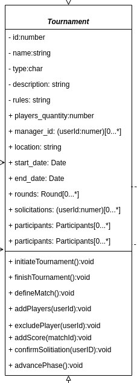
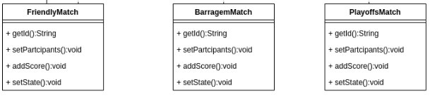
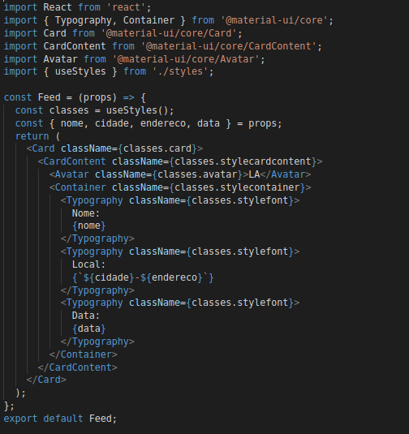
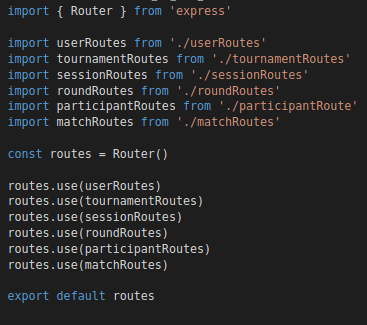
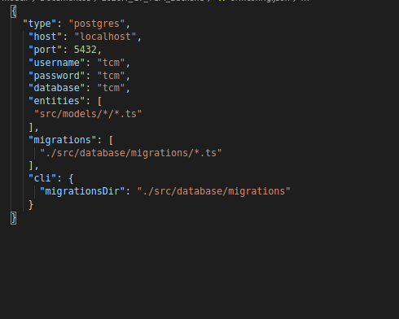

# Reutilização de Software

## Introdução

Reutilização de software é o processo de criação de software a partir de software já existente (KRUEGER, 1992). Os termos reutilização de software e reutilização de código costumam ser tratados como sinônimos, entretanto, enquanto o código lida com estruturas como classes, funções, métodos e atributos, o software é muito mais âmplo, indo desde o próprio código até artefatos de documentação de arquitetura. Reutilizar artefatos de software contribuem fortemente para a qualidade de software e para a eficiência da equipe de desenvolvimento.

## Framework

Framework é uma técnica de Orientação a Objetos voltada para reutilização de software e utiliza três conceitos básicos de OO: abstração, polimorfismo e herança. Ele fornece uma descrição da arquitetura do sistema, serivndo como um template, que pode ser customizado para se adequar a outras aplicações. Com isso, é possível reutilzar grandes porções de código, até mesmo subsistemas, e assim melhorar a qualidade do sistema e a eficiência da equipe.

Existem dois conceitos importantes no Framework:

- Hot Spot: uma parte do framework onde uma adaptação pode ser feita. Alguns exemplos de hot spot são: classes abstratas, métodos abstratos, métodos hook, etc. São projetados para serem genéricos.

Um exemplo de Hot Spot na no sistema é a classe Tournament:

- Frozen Spot: uma parte do framework que não foi projetada para adaptação. Alguns exemplos de frozen spot são: classes concretas, métodos template, etc. Permanecem fixos em todas as instanciações do framework de aplicação.

Os Framework podem ser classificados em 3 tipos:

- White Box: reutilização provida por pontos flexíveis, normalmente utilizando o conceito de herânca e padrões de projeto específicos. Framework orientado a hot spots.

Exemplo de White Box seria o componente React: apesar de já ter sido previamente implementado por terceiros, é possível a cada projeto extender o componente de maneiras muito diferentes, ou seja, componentes são extremamente flexíveis e expansíveis.

- Black Box: reutilização provida por composição. Framework orientado a frozen spots.

Exemplo de Black Box seria o Express, pois no nosso contexto é pouco flexível, apenas aceita entradas e sem muitas modificações.

- Grey Box: híbrido entre White e Black Box. Framework que permite reutilização através de hot e frozen spots.

Exemplo de Grey Box seria o TypeORM, que utiliza Hot Spots (manipular repository) e Frozen Spots (conexão com o banco de dados).

## Reutilização no Back-End

### Express

Express é um framework web em node, livre e de código aberto, criado para otimização de aplicações web e API's

### Typeorm

TypeORM é um framework ORM executado em NodeJS, que pode ser utilizado com TypeScript e JavaScript. com o objetvo de sempre estar atualizado com as ultimas features do Javascript que auxiliam na utilização de aplicações com banco de dados, desde aplicações pequenas a aplicações de larga escala de form escalável

TypeORM é influenciado por outros ORMs, como o Hibernate, Doctrine e Entity Framework.

### Controllers e Services

As <a href='https://github.com/UnBArqDsw/2020.1_G7_TCM_Backend/blob/master/src/controllers/protocols/IController.ts'>controllers</a> e <a href='https://github.com/UnBArqDsw/2020.1_G7_TCM_Backend/blob/master/src/services/protocols/IServices.ts'>services</a> implementados na aplicação (TCM) utilizam protocolos pré-estabelecidos por interfaces, definindo os padrões de entrada e saida, podendo ser definidos como componentes.

### Serviços

Os serviços implementados na aplicação (TCM) <a href='https://github.com/UnBArqDsw/2020.1_G7_TCM_Backend/blob/master/src/services/protocols/IServices.ts'>Implementação</a>

## Reutilização no Front-End

### Material-ui

Biblioteca que possui componentes React reutilizáveis e costumizáveis, que utilizam o padrão de design do Material Design

### React

### Componentes
A utilização do React permite criar componentes como classes ou funções. Com o React é possível criar componentes flexíveis, modulares e reutilizaveis em toda aplicação seguindo protocolos especificados pela bibilioteca.

### Serviços
Utilizamos uma camada de serviços para fazer as requisições com o backend

## Conclusão

Através da aplicação dos conceitos de reutilização, é possível melhorar a qualidade geral do sistema, além de agilizar o processo. Não é necessário "reinventar a roda" a cada novo projeto se já existir uma base sólida e reutilizável.

## Referências

> DevMedia. Frameworks e Padrões de Projeto. Disponível em https://www.devmedia.com.br/frameworks-e-padroes-de-projeto/1111 Acessado em 20/11/2020.

> KRUEGER, C; Software Reuse. ACM Computing Surveys, v. 24, n. 02, p. 131–183, 1992.

> LUCRÉDIO, D; Uma Abordagem Orientada a Modelos para Reutilização de Software. Disponível em http://ivanmachado.com.br/research/rise/thesis/files/2009_DanielLucredio_phd.pdf Acessado em 20/11/2020.

> SERRANO, M; Arquitetura e Desenho de Software, Aula - Reutilização de Software. UnB-FGA. Acessado em 20/11/2020.

> VERGILIO, S, R; Padrões Arquiteturais. Disponível em: http://www.inf.ufpr.br/andrey/ci163/PadroesFrameworksAl.pdf Acessado em 20/11/2020.

> React.Component. Disponível em: https://pt-br.reactjs.org/docs/react-component.html#gatsby-focus-wrapper

> MATERIAL-UI. Disponível em: https://material-ui.com/pt/

## Autor(es)

| Data | Versão | Descrição | Autor(es) |
| ---- | ------ | --------- | --------- |
| 20/11/20 | 1.0 | Criação do documento | Lucas Alexandre, Matheus Estanislau, Moacir Mascarenha e Renan Cristyan |
| 20/11/20 | 1.1 | Adição de reutilização do Frontend e Backend | Lucas Alexandre, Matheus Estanislau, Moacir Mascarenha e Renan Cristyan |
|20/11/20| 1.2 | Adicição de host pots e frozen pots | Lucas Alexandre, Moacir Mascarenha, Renan Cristyan |
