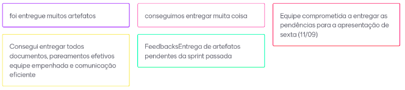
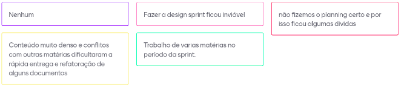

# Sprint 2 (01/09/20 à 07/09/20)

## Sprint Planning

#### Presentes na reunião: Todos

###  Sprint Backlog

|Tarefa|Responsabilidade|
|---|----|
|Cadastrar issues. |Matheus|
|[Prototipação.](https://github.com/UnBArqDsw/2020.1_G7_TCM/blob/master/docs/base/prototipo_alta_fidelidade.md) |Matheus e Lucas|
|Elaborar [Plano de Tempo](https://github.com/UnBArqDsw/2020.1_G7_TCM/blob/master/docs/base/Gerenciamento_Cronograma.md). |João e Moacir|
|Elaborar [Entrevista](https://github.com/UnBArqDsw/2020.1_G7_TCM/blob/master/docs/base/entrevista.md). |João|
|Estudar metodologia. |todos|
|Documentar os [léxicos](https://github.com/UnBArqDsw/2020.1_G7_TCM/blob/master/docs/base/lexicos.md). |Renan e João|
|Documentar Design Sprint. |Lucas e Moacir|
|Documentar a [metodologia](https://github.com/UnBArqDsw/2020.1_G7_TCM/blob/master/docs/base/metodologia.md). |Moacir e João|
|[Persona](https://github.com/UnBArqDsw/2020.1_G7_TCM/blob/master/docs/base/personas.md) P.O. / [Backlog](https://github.com/UnBArqDsw/2020.1_G7_TCM/blob/master/docs/base/backlog.md). |Renan, Lucas e Matheus|
|Elaborar diagrama BPMN da metodologia. |Todos|
|Criar canal e configurar Slack. |Lucas|
|Elaborar mapa mental brainstorm. |João|

## Sprint Retrospective/Review Meeting

#### Presentes na reunião: Todos

### Dividas da sprint
- Design sprint
- Diagrama BPMN
- Diagrama causa e efeito

### Riscos Enontrados

- Entrega de outras matérias no período a sprint [R07](https://github.com/UnBArqDsw/2020.1_G7_TCM/blob/master/docs/base/plano_de_gerencia_de_risco.md).

### Pontos Positivos

### Pontos Negativos

### O que podemos melhorar?
- Revisar os documentos durante a sprint.
- Planejar melhor as tarefas.
- Colocar em prática feedback do monitor.

### Ferramentas utilizadas

- Reunião: [Hangouts](https://hangouts.google.com/)
- Colheita dos pontos: [Mentimeter](https://www.mentimeter.com/)

