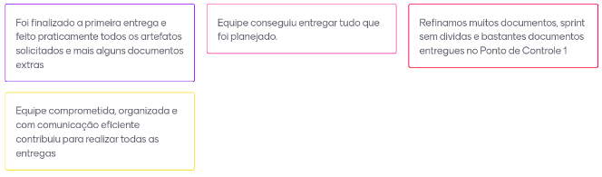
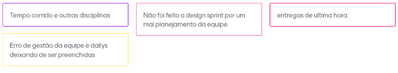

# Sprint 3  (07/09/20 à 14/09/20)

## Sprint Planning

#### Presentes na reunião: Todos

###  Sprint Backlog

|Tarefa| Responsabilidade|
|---|----|
|Refinar bpmn |Todos|
|[Causa e efeito](https://github.com/UnBArqDsw/2020.1_G7_TCM/blob/master/docs/base/causa_e_efeito.md)|Renan e Matheus|
|Priorização |Todos|
|Documentar sprints |Moacir|
|Refinar metodologia |joão e Matheus|
|Ajustar o pages |Matheus|
|Refinar backlog |todos|
|Refinar 5w2h | Moacir |
|Revisar todos os documentos antes da entrega |todos|
|Refinar protótipo |Todos|
|Entrega do projeto|Não definido|
|Avaliação em pares| Não definido|

## Sprint Retrospective/Review Meeting

#### Presentes na reunião: Todos

### Dividas da sprint
    - Nada

### Riscos Encontrados
    - Nenhum

### Pontos Positivos

### Pontos Negativos

### O que podemos melhorar?

- Preencher as dailys diariamente
- Se comunicar mais no github
- Ter mais atenção com o planejamento da sprint

### Ferramentas utilizadas

- Reunião: [Hangouts](https://hangouts.google.com/)
- Colheita dos pontos: [Mentimeter](https://www.mentimeter.com/) 

