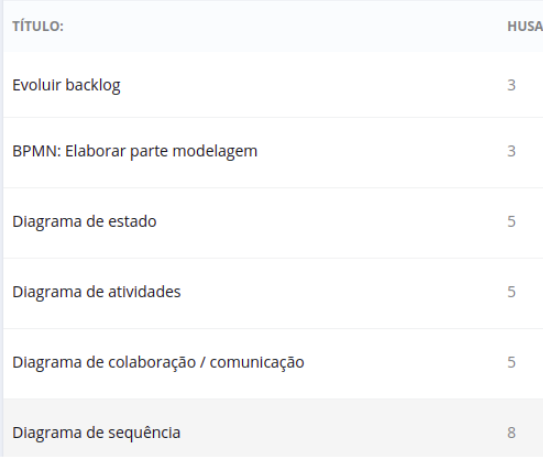

# Sprint 5  (22/09/20 à 28/09/20)

## Sprint Planning

#### Presentes na reunião: Todos

###  Sprint Backlog

|Tarefa| Responsabilidade|
|---|----|
|Montar ambiente de desenvolvimento |João, Matheus e Renan|
|Definir logo |Todos|
|Diagrama sequencia |Moacir e Matheus| 
|Diagrama colaboração/comunicação |João e Lucas|
|Diagrama atividades |Renan e João|
|Diagrama estado |Renan e Moacir|
|Criar diagrama BPMN módulo modelagem |Renan|
|Evoluir backlog |Matheus e Lucas|
|Plano de gcs |Não definido|

### Pontuação das tarefas

<!-- ## Sprint Retrospective/Review Meeting

#### Presentes na reunião: Todos

### Dividas da sprint

### Riscos Encontrados

### Pontos Positivos

### Pontos Negativos

### O que podemos melhorar? -->

### Ferramentas utilizadas

- Reunião: [Hangouts](https://hangouts.google.com/)
<!-- - Colheita dos pontos: [Mentimeter](https://www.mentimeter.com/)  -->
- Pontuar tarefas: [planitpoker](https://www.planitpoker.com/)
