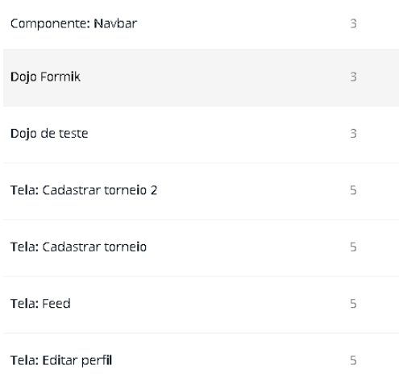
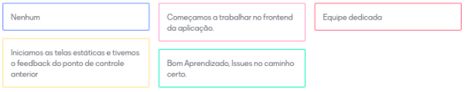
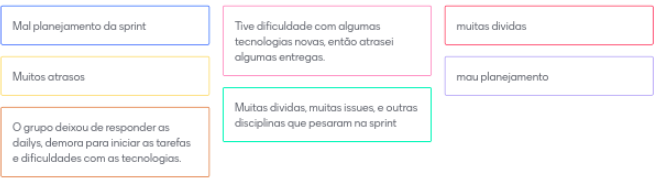

# Sprint 6  (29/09/20 à 06/10/20)

## Sprint Planning

#### Presentes na reunião: Todos

###  Sprint Backlog

|Tarefa| Responsabilidade|
|---|----|
|Evoluir backlog |Lucas e Matheus|
|Configurar ambiente de desenvolvimento |Matheus e Renan|
|Definição das tecnologias |Todos|
|Guia de estilo |João e Matheus|
|Appbar estático |Renan e  Moacir| 
|NavBar estático |Renan e  Moacir| 
|Tela cadastro estático |Lucas e Matheus| 
|Tela editar perfil estático |João e Lucas| 
|Feed estático |João e Lucas| 
|Cadastrar torneio estático |Renan e  Moacir| 
|Cadastrar torneio segunda parte estático |Renan e  Moacir| 
|Dojo de teste estático|Todos| 
|Estudar formik |Todos| 

### Pontuação das tarefas

## Sprint Retrospective/Review Meeting

#### Presentes na reunião: Todos

### Dividas da sprint
- Cadastrar torneio 1 e 2
- Tela de editar perfil estática
- Definição das tecnologias

### Riscos Encontrados
- R01
- R08
- R12

[Plano de riscos](https://github.com/UnBArqDsw/2020.1_G7_TCM/blob/master/docs/base/plano_de_gerencia_de_risco.md)

### Pontos Positivos

### Pontos Negativos

### O que podemos melhorar?

- Responder daily.
- Melhorar planejamento.

### Ferramentas utilizadas

- Reunião: [Hangouts](https://hangouts.google.com/)
- Colheita dos pontos: [Mentimeter](https://www.mentimeter.com/) 
- Pontuar tarefas: [planitpoker](https://www.planitpoker.com/)
