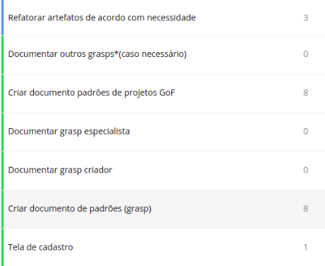
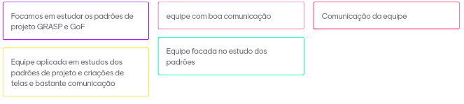
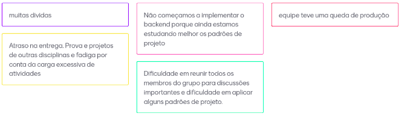

# Sprint 7  (07/10/20 à 13/10/20)

## Sprint Planning

#### Presentes na reunião: Todos

###  Sprint Backlog

|Tarefa| Responsabilidade|
|---|----|
|Cadastrar torneio estático |Renan e  Moacir| 
|Cadastrar torneio segunda parte estático |Renan e  Moacir| 
|Tela editar perfil estático |João e Lucas|
|Tela cadastro estático |Lucas e Matheus|
|Definição das tecnologias|Todos|
Criar documento padrões de projetos grasp |Todos|
Documentar outros grasps*|Todos|
Criar documento padrões de projetos GoF |Todos|
Fazer melhoria de acordo com os padrões  |Todos| 
|revisar interfaces do diagrama de componentes |João e Renan| 
|mudar nomes do diagrama de pacotes |Lucas| 
|mudar especificações do diagrama de sequência |Moacir e Matheus| 
|revisar nomes no diagrama de estados |Renan| 

### Pontuação das tarefas

## Sprint Retrospective/Review Meeting

#### Presentes na reunião: Todos

### Dividas da sprint
- Criar documento padrões de projetos grasp 
- Documentar outros grasps*(caso necessário)
- Criar documento padrões de projetos GoF 
- Revisar interfaces do diagrama de componentes 
- Mudar nomes do diagrama de pacotes 
- Mudar especificações do diagrama de sequência 

### Riscos Encontrados
- R01
- R05
- R08
- R12
- R13
- R15

[Plano de riscos](https://github.com/UnBArqDsw/2020.1_G7_TCM/blob/master/docs/base/plano_de_gerencia_de_risco.md)

### Pontos Positivos

### Pontos Negativos

### O que podemos melhorar?
- Buscar melhorias para o estudo da equipe
- Distribuição de tarefas

### Ferramentas utilizadas

- Reunião: [Hangouts](https://hangouts.google.com/)
- Colheita dos pontos: [Mentimeter](https://www.mentimeter.com/) 
- Pontuar tarefas: [planitpoker](https://www.planitpoker.com/)
