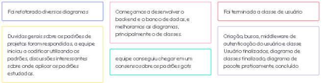

# Sprint 8  (13/10/20 à 19/10/20)

## Sprint Planning

#### Presentes na reunião: Todos

###  Sprint Backlog

|Tarefa| Responsabilidade|
|---|----|
|Criar documento padrões de projetos grasp |Todos|
|Documentar outros grasps*|Todos|
|Criar documento padrões de projetos GoF |Todos|
|revisar interfaces do diagrama de componentes |João e  Renan| 
|mudar especificações do diagrama de sequência |Moacir e  Matheus| 
Criar controler, serviço, repository e model classe usuario |Matheus e Lucas|
Criar controler, serviço, repository e model classe torneio |João e Moacir e Renan|
Criar controler, serviço, repository e model classe partida |joao e Moacir e Renan| 
|Estudar padrões estruturais|Todos|
|Estudar orm para typescript|Todos|

### Pontuação das tarefas

Não realizado

## Sprint Retrospective/Review Meeting

#### Presentes na reunião: Todos

### Dividas da sprint
- Criar controler, serviço, repository e model classe torneio
- Criar controler, serviço, repository e model classe partida 

### Riscos Encontrados
- R01
- R04
- R08
- R11
- R15

[Plano de riscos](https://github.com/UnBArqDsw/2020.1_G7_TCM/blob/master/docs/base/plano_de_gerencia_de_risco.md)

### Pontos Positivos

### Pontos Negativos

### O que podemos melhorar?
- Distribuir melhor as atividades da sprint
- Melhorar abordagem ao utilizar os pareamentos
- Tentar ser mais objetivo nas reuniões

### Ferramentas utilizadas

- Reunião: [Hangouts](https://hangouts.google.com/)
- Colheita dos pontos: [Mentimeter](https://www.mentimeter.com/) 
- Pontuar tarefas: [planitpoker](https://www.planitpoker.com/)
